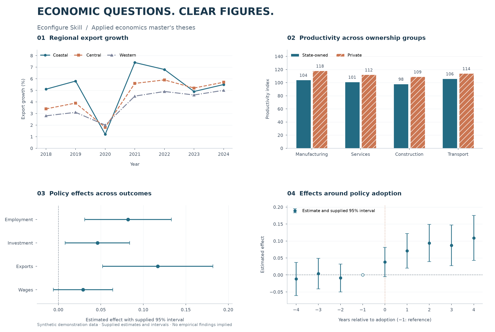
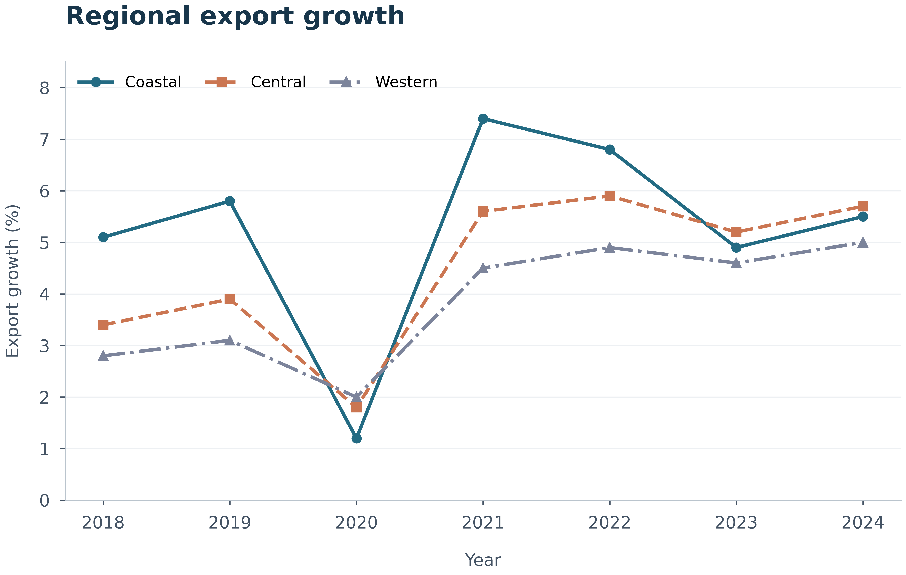
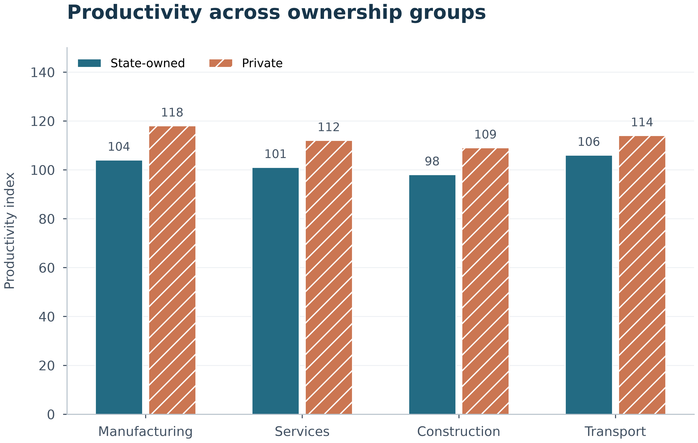
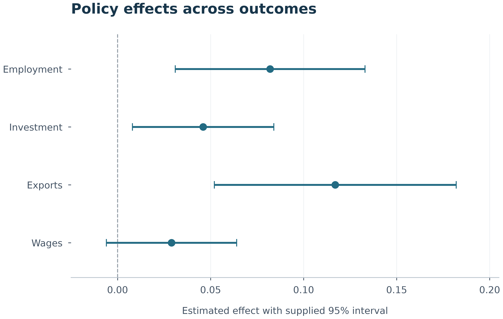
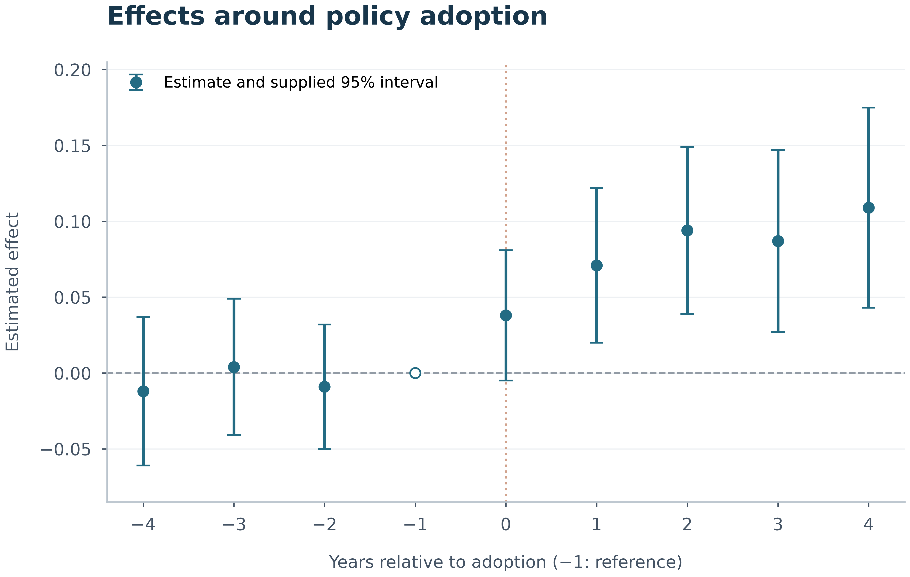
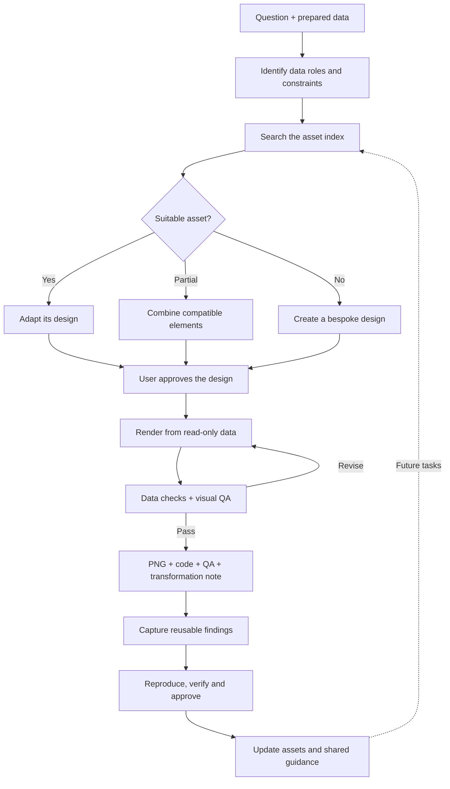

<div align="center">

<h1>Econfigure Skill</h1>

<p><strong>让应用经济学硕士毕业论文图表清晰、规范、可复现</strong></p>
<p>先确认设计，再生成图表。资产优先，表达自由。</p>

<p>
<a href="LICENSE"></a>


</p>
<p><a href="#preview">效果预览</a> · <a href="#project-focus">项目定位</a> · <a href="#capabilities">核心能力</a> · <a href="#figure-types">图表全览</a> · <a href="#workflow">工作流</a> · <a href="#institution-templates">学校模板</a> · <a href="#installation">安装</a> · <a href="#usage">快速开始</a> · <a href="#quality">质量评估</a></p>
<p><a href="README.md">简体中文</a> | <a href="README_EN.md">English</a></p>
</div>

---

<!-- section:preview -->
<a id="preview"></a>

## 效果预览

<p align="center"><a href="assets/showcase/econfigure-skill-preview.png"></a></p>

四个案例使用**明确标注的合成数据**，展示论文中常见的趋势、组间比较、系数与政策动态。点开查看大图；每个案例均有输入 CSV、需求说明、验收要求及 600 dpi PNG。这里的数字不代表真实研究结论。

<details>
<summary>展开查看四个完整尺寸样例</summary>

| 趋势比较 | 组间比较 |
|---|---|
| [](assets/standard_samples/regional-export-trend/) | [](assets/standard_samples/ownership-productivity-comparison/) |
| 系数与区间 | 政策动态 |
| [](assets/standard_samples/policy-coefficients/) | [](assets/standard_samples/event-study-dynamics/) |

</details>

[浏览全部 67 项资产 →](assets/figure-atlas.md) · [复跑样例 →](assets/standard_samples/README.md)

<!-- section:project-focus -->
<a id="project-focus"></a>

## 为论文中的经济问题选择合适表达

Econfigure Skill 是面向 **应用经济学硕士毕业论文图表** 的 Agent Skill。把研究问题、已整理的数据或已有估计结果交给 Agent，它会先提出图形设计方案，经你确认后再编写或适配代码，输出可复现的 PNG。

核心目标是帮助完成毕业论文中的清晰表达和版式适配；期刊投稿并非默认目标。学校、字体和字号不会被固定，只有明确选择模板时才启用相应要求。

**你负责研究判断，Skill 负责图形表达。** 它不替你估计回归、重新计算置信区间或构造研究指标；需要拟合曲线时，应提供已计算的曲线数据。输入不足以支持图形含义时，先补齐数据。

<!-- section:capabilities -->
<a id="capabilities"></a>

## 设计原则与核心能力

### 设计原则

| 原则 | 说明 |
|---|---|
| 问题驱动 | 从论文的研究问题出发，选择能够清晰呈现比较关系和证据的图形 |
| 信息聚焦 | 围绕一个核心信息组织图形，多面板各自承担明确的表达任务 |
| 视觉一致 | 统一字体层级、色彩语义与布局，使整组图表形成连贯的视觉语言 |
| 数据忠实 | 图形编码准确对应变量和统计量，确保视觉表达与数据含义一致 |
| 可复现性 | 以数据、参数和绘图代码共同定义结果，支持重复生成与后续调整 |

### 核心能力

| 能力 | 说明 |
|---|---|
| 图型选型 | 覆盖趋势、比较、构成、分布、变量关系、估计结果与政策动态等论文任务 |
| 语义资产检索 | 根据数据角色、图形结构与视觉元素筛选资产，再核对候选资产的数据要求 |
| Copy-First 代码复用 | 从匹配的生产脚本开始适配，复用已有的绘制与布局实现 |
| 跨图型组合设计 | 组合兼容图元，按语义约束、比例参数和逻辑开关继承设计；支持独立设计 |
| 学校模板适配 | 按选定的学校模板应用字体、图表标题和表格格式规范 |
| 图表联合交付 | 生成 600 dpi PNG 图形与 Word 三线表，配套质量报告和数据处理说明 |
| 分阶段质量验证 | 执行设计、数据、代码、渲染与交付五轮 QA，并提供资产运行评估工具 |
| 经验资产持续积累 | 将经过验证的设计模式与修正方法沉淀为可检索资产、共享指南和验收用例，服务后续作图 |

<!-- section:figure-types -->
<a id="figure-types"></a>

## 图表类型全览

图形案例根据公开学术文献收集并以 Python 实现。点击预览查看大图，完整资产与数据要求见[公开图鉴](assets/figure-atlas.md)。

| 图表名称 | 预览 | 图形特征 | 典型应用场景 |
|---|---|---|---|
| 趋势折线 | <a href="assets/figures/line-trend/dual-series-trend-prediction-2panel.png"></a> | 有序时间轴、线型与点型编码、单图或分面布局 | 连续年份趋势、双序列变化、结构分化 |
| 区间与置信带 | <a href="assets/figures/interval-band/irf-shaded-ci-2x3.png"></a> | 中心路径与上下界带状编码、多层区间或多面板 | 置信区间、脉冲响应、分位数效应 |
| 面积图 | <a href="assets/figures/area-chart/stacked-area-portfolio-composition.png"></a> | 连续堆叠色带、总量与成分同步呈现 | 构成随时间变化、累计规模 |
| 单组柱状比较 | <a href="assets/figures/bar-comparison/monotonic-vbar-value-labels.png"></a> | 条柱长度编码、类别排序、正负方向与数值标注 | 排序、正负变化、标准化比较 |
| 分组柱状图 | <a href="assets/figures/grouped-bar/grouped-vbar-benchmark-2x2.png"></a> | 类别内并列条柱、系列编码与共享面板结构 | 类别内多组对比、多面板基准比较 |
| 堆叠柱状图 | <a href="assets/figures/stacked-bar/decomposition-100pct-hbar-2x2.png"></a> | 分段条柱、绝对量或百分比尺度、成对构成比较 | 百分比构成、分解、成对堆叠 |
| 误差棒柱状图 | <a href="assets/figures/bar-with-error/grouped-vbar-errorbars-three-treatments.png"></a> | 条柱叠加误差区间、端帽与比较注释 | 组间均值及不确定性、处理效应比较 |
| 散点与关系诊断 | <a href="assets/figures/scatter-relationship/binscatter-diagnostic-2x2.png"></a> | 点位置编码、分组或分箱散点、可叠加已提供的拟合路径 | 两变量关系、分箱散点、拟合诊断 |
| 分布图 | <a href="assets/figures/distribution/crop-output-density-2x2.png"></a> | 频率或密度曲线、多组叠加与分面比较 | 密度、频率、基线与期末分布 |
| 箱线与条带图 | <a href="assets/figures/box-plot/annual-boxplot-trend.png"></a> | 四分位箱体、中位线、须线或独立观测点 | 组间分布、年度分布、离群值 |
| 系数图 | <a href="assets/figures/coefficient-plot/treatment-arm-domain-intervals.png"></a> | 点估计与区间、零值参照、多模型或多结果排列 | 回归系数、处理组比较、森林图 |
| 事件研究 | <a href="assets/figures/event-study/event-response-2x2-dashed-bounds.png"></a> | 相对事件时间、动态效应与区间、政策时点和基期标识 | 政策实施前后动态、平行趋势展示 |
| 热图 | <a href="assets/figures/heatmap/exposure-sales-diverging-heatmap.png"></a> | 矩阵色阶编码、连续或发散配色、行列分组 | 状态—时间矩阵、暴露强度、选择结果 |
| 瀑布图 | <a href="assets/figures/waterfall/export-value-added-waterfall-2panel.png"></a> | 浮动条柱、增减贡献与累计终点、分解连接关系 | 指标变化分解、正负贡献及累计结果 |

<!-- section:workflow -->
<a id="workflow"></a>

## 系统工作流

从研究问题到图形交付，依次完成以下步骤：

```text
用户意图解析 → 图形设计 → 代码执行 → 质量验收 → 成果交付

Step 1  需求解析  | 确定研究问题、展示对象和图表用途。
Step 2  数据解析  | 只读检查字段、单位、分组与时间结构，确认图形所需的数据角色。
Step 3  图型选型  | 根据比较目标和数据结构选择图型，确定面板组织方式。
Step 4  资产匹配  | 检索兼容资产，选择直接复用、图元组合或独立设计。
Step 5  方案确认  | 提交数据映射、布局、编码与格式方案，由用户确认。
Step 6  代码适配  | 映射用户数据，适配生产脚本及图形参数，记录必要的数据处理。
Step 7  预检与渲染  | 检查依赖、字体和绘图数据，按目标尺寸生成 600 dpi PNG。
Step 8  质量验证  | 执行五轮 QA，检查代码与成图，修正不合格项并重新渲染。
Step 9  成果交付  | 提交最终 PNG、QA 报告与数据处理说明，并保留可复跑代码。
Step 10  经验沉淀  | 提炼可复用经验，经复现、验证与维护审批后更新资产和指南。
```

<details>
<summary>查看流程图</summary>



</details>

### 经验资产的持续积累

每次作图产生的新设计模式或有效修正，都可以成为后续任务的可复用知识。Skill 通过以下闭环沉淀经验：

**发现与记录 → 复现与验证 → 审核入库 → 检索复用**

| 环节 | 产出 |
|---|---|
| 发现与记录 | 记录适用条件、问题原因、修正方法和例外，明确单资产、图型或通用规则的范围 |
| 复现与验证 | 使用最小合成样例验证方法，保留相关 QA 结果与验收用例 |
| 审核入库 | 经维护审批更新生产资产、语义说明或共享指南，并刷新索引与图鉴 |
| 检索复用 | 后续任务通过资产标签和主题文档获得已验证经验，减少重复试错 |

这是由 Agent 执行、经审核更新的知识积累机制。候选记录保存在用户工作区；公开 Skill 仅保留通用方法和可再分发样例。完整规则见[经验资产机制](references/experience-learning.md)。

<!-- section:institution-templates -->
<a id="institution-templates"></a>

## 学校模板

学校模板位于 [`assets/institution-templates/`](assets/institution-templates/README.md)，全部是**显式选择**的可选配置，不会成为全局默认。

已包含江西财经大学硕士学位论文的[机器配置](assets/institution-templates/jiangxi-university-of-finance-and-economics/template.yaml)、[使用说明](assets/institution-templates/jiangxi-university-of-finance-and-economics/README.md)和原始 Word 模板。使用时告诉 Agent“采用江西财经大学模板”，或提供自己的论文模板。若用户文件与内置配置冲突，以用户文件为准。

添加其他学校时，复制 `assets/institution-templates/_template/`，使用学校英文名称的 kebab-case 目录名，填写权威来源、字体、字号、图表标题位置、表格规则和生效范围。只有允许再分发时才放入原始模板文件。

<!-- section:installation -->
<a id="installation"></a>

## 安装

下载本仓库的 ZIP，解压后将**整个目录**命名为 `econfigure`。按下表放置；不要只复制 `SKILL.md`。各平台的指令机制不同，下表提供原生 Skill 或规则适配入口，具体自动触发行为取决于客户端版本。

| Agent | 放置与启用方式 | 详细说明 |
|---|---|---|
| Claude Code | `.claude/skills/econfigure/` · `/econfigure` | [Claude Code](install/claude-code/INSTALL.md) |
| Codex | `.agents/skills/econfigure/` · `$econfigure` | [Codex](install/codex/INSTALL.md) |
| Cursor | `.ai/econfigure-skill/` + `.cursor/rules/econfigure.mdc` | [Cursor rule](install/cursor/econfigure.mdc) |
| GitHub Copilot | `.ai/econfigure-skill/` + `.github/copilot-instructions.md` | [Copilot instructions](install/copilot/copilot-instructions.md) |

以上路径均相对于你的工作项目。已有 Copilot 指令时应合并，避免覆盖。安装后，在 Skill 根目录创建 Python 环境并安装依赖：

```bash
python -m venv .venv
# macOS / Linux
source .venv/bin/activate
# Windows PowerShell: .venv\Scripts\Activate.ps1
python -m pip install -r requirements.txt
```

建议 Python 3.11。中文图形需要系统安装可用中文字体；启用学校模板时，应另行安装该模板指定字体。


安装机制参考：[Claude Code](https://code.claude.com/docs/en/skills) · [Codex](https://developers.openai.com/codex/skills/) · [Cursor](https://cursor.com/docs/rules) · [GitHub Copilot](https://code.visualstudio.com/docs/agent-customization/custom-instructions).

<!-- section:usage -->
<a id="usage"></a>

## 快速开始

将数据文件放进你的工作项目，然后向 Agent 说明图形要回答的问题：

```text
使用 Econfigure Skill。根据 exports.csv 比较三个地区的出口增长趋势。
数据已经整理好，请先提出适合硕士毕业论文的设计方案，
确认后输出 PNG、可复跑代码和 QA 说明。
```

已有估计结果时，说明区间和基准组；需要学校规范时显式选择模板：

```text
使用 Econfigure Skill 和江西财经大学模板。results.csv 中 estimate、
low、high 分别是系数和已计算的 95% 置信区间，参照组已在说明列给出。
请画系数图，不重新估计或计算区间。
```

无需 Agent 即可查看出图效果：

```bash
python scripts/render_standard_samples.py --showcase
```

输出位于 `assets/standard_samples/`；首页组合预览位于 `assets/showcase/`。

<!-- section:quality -->
<a id="quality"></a>

## 质量评估与测试

### QA 五轮协议

| 轮次 | 名称 | 检查项数 | 说明 |
|---|---|---:|---|
| Pass 0 | 设计审核（RD） | 7 | 表达目标、图型适配、方案确认、实现路线、资产依据与禁用形式 |
| Pass 1 | 数据边界与可行性（RF） | 14 | 源数据完整性、字段与单位、处理记录、时间覆盖、基线、区间及构成关系 |
| Pass 2 | 代码实现（RI） | 9 | 资产复用、图元组合、数据与绘图分离、路径管理、确定性及运行状态 |
| Pass 3 | 渲染验证（RV） | 22 | PNG 规格、尺寸、字体、坐标轴、图例、注释、多面板一致性与视觉可读性 |
| Pass 4 | 交付审核（DL） | 6 | 信息表达、结论边界、论文图题分离、文档一致性、文件命名与配套报告 |

共 **58 项检查**，完整定义见 [QA 协议](references/qa-real-use.md)。各项记录为 `PASS`、`FAIL`、`WARN` 或 `N/A`：失败项修正后才能交付，警告项需说明处理结果，不适用项说明原因。QA 由 Agent 结合数据、代码和成图执行；运行评估工具负责其明确覆盖的自动检查。

### 运行评估

```bash
# 全量资产评估：清单、数据角色及脚本执行
python scripts/eval_runner.py --execute

# 单类图形评估
python scripts/eval_runner.py --execute --family heatmap

# 单个资产评估
python scripts/eval_runner.py --execute --asset annual-boxplot-trend

# 标准样例：渲染、输入完整性与输出规格检查
python scripts/render_standard_samples.py --output-dir ./sample-output

# 数据门禁测试
python -m unittest discover -s tests -p "test_*.py"

# 基础图形与 Word 三线表集成测试
python tests/smoke_test.py
```

不加 `--execute` 时，资产评估仅检查清单结构、数据列角色覆盖及文件引用。标准样例覆盖趋势、分组比较、系数和事件研究；视觉与语义检查按上述 QA 协议完成。

<!-- section:structure -->
<a id="structure"></a>

## 项目结构

目录包含技能入口、共享知识、生产资产、绘图组件和运行工具：

```text
econfigure/                                                ← Econfigure Skill 核心包
├── .github/                                               ← 协作模板与持续集成
│   ├── ISSUE_TEMPLATE/                                    ← 问题与需求模板
│   │   ├── bug_report.yml                                 ← 问题报告模板
│   │   └── feature_request.yml                            ← 功能需求模板
│   ├── workflows/                                         ← 持续集成配置
│   │   └── ci.yml                                         ← 自动运行验证流程
│   └── pull_request_template.md                           ← 代码贡献说明模板
├── agents/                                                ← Agent 展示配置
│   └── openai.yaml                                        ← Codex 名称、简介与调用提示
├── assets/                                                ← 图形资产、模板与样例
│   ├── figures/                                           ← 图型脚本、预览、数据与语义清单
│   │   ├── area-chart/                                    ← 面积图
│   │   ├── bar-comparison/                                ← 单组柱状比较
│   │   ├── bar-with-error/                                ← 误差棒柱状图
│   │   ├── box-plot/                                      ← 箱线与条带图
│   │   ├── coefficient-plot/                              ← 系数图
│   │   ├── distribution/                                  ← 分布图
│   │   ├── event-study/                                   ← 事件研究
│   │   ├── grouped-bar/                                   ← 分组柱状图
│   │   ├── heatmap/                                       ← 热图
│   │   ├── interval-band/                                 ← 区间与置信带
│   │   ├── line-trend/                                    ← 趋势折线
│   │   ├── scatter-relationship/                          ← 散点与关系诊断
│   │   ├── stacked-bar/                                   ← 堆叠柱状图
│   │   └── waterfall/                                     ← 瀑布图
│   ├── institution-templates/                             ← 可选学校论文模板包
│   │   ├── _template/                                     ← 新增学校配置的起始模板
│   │   │   └── template.yaml                              ← 模板来源、格式参数与适用范围
│   │   ├── jiangxi-university-of-finance-and-economics/   ← 江西财经大学模板包
│   │   │   ├── README.md                                  ← 目录使用说明
│   │   │   ├── jufe-master-thesis-template.doc            ← 学校 Word 模板文件
│   │   │   └── template.yaml                              ← 模板来源、格式参数与适用范围
│   │   └── README.md                                      ← 目录使用说明
│   ├── showcase/                                          ← 首页效果预览
│   │   └── econfigure-skill-preview.png                   ← 首页组合预览图
│   ├── standard_samples/                                  ← 合成数据与可复跑标准样例
│   │   ├── event-study-dynamics/                          ← 政策动态样例
│   │   ├── ownership-productivity-comparison/             ← 所有制与生产率比较样例
│   │   ├── policy-coefficients/                           ← 政策系数样例
│   │   ├── regional-export-trend/                         ← 地区出口增长趋势样例
│   │   ├── README.md                                      ← 目录使用说明
│   │   └── sample.schema.yaml                             ← 标准样例字段规范
│   ├── asset.schema.yaml                                  ← 单资产清单字段规范
│   ├── catalog.index.yaml                                 ← 用于候选筛选的机器索引
│   ├── catalog.schema.yaml                                ← 机器索引字段规范
│   └── figure-atlas.md                                    ← 完整公开图鉴
├── chartlib/                                              ← 共享绘图与数据组件
│   ├── __init__.py                                        ← 包初始化与运行缓存配置
│   ├── asset_runtime.py                                   ← 资产脚本的运行与导出基础
│   ├── comparison_renderers.py                            ← 比较类图形渲染
│   ├── data_io.py                                         ← 数据读取与 AuditLog 处理记录
│   ├── env_check.py                                       ← 依赖与字体环境自检
│   ├── figures.py                                         ← 基础图型绘制接口
│   ├── inference_renderers.py                             ← 估计结果与区间图形渲染
│   ├── matrix_decomposition_renderers.py                  ← 矩阵与分解图形渲染
│   ├── savefig.py                                         ← PNG 导出与交付提示
│   └── tables.py                                          ← Word 三线表生成
├── install/                                               ← 跨平台安装与路由适配
│   ├── claude-code/                                       ← Claude Code 原生 Skill 安装
│   │   └── INSTALL.md                                     ← 平台安装说明
│   ├── codex/                                             ← Codex 原生 Skill 安装
│   │   └── INSTALL.md                                     ← 平台安装说明
│   ├── copilot/                                           ← GitHub Copilot 指令适配
│   │   └── copilot-instructions.md                        ← Copilot Skill 路由指令
│   ├── cursor/                                            ← Cursor 项目规则适配
│   │   └── econfigure.mdc                                 ← Cursor Skill 路由规则
│   └── README.md                                          ← 目录使用说明
├── references/                                            ← 按任务加载的共享知识文档
│   ├── asset-engineering.md                               ← 资产新增、更新与入库规范
│   ├── asset-provenance.md                                ← 文献资产来源与权利边界
│   ├── asset-retrieval.md                                 ← 两层检索与候选资产匹配
│   ├── color-palettes.md                                  ← 配色语义与可辨识性
│   ├── common-pitfalls.md                                 ← 常见作图问题与处理原则
│   ├── experience-learning.md                             ← 经验记录、验证、入库与复用
│   ├── figure-deconstruction.md                           ← 图元解构与跨资产组合
│   ├── institution-templates.md                           ← 学校模板的选择与应用
│   ├── parameter-system.md                                ← 语义约束、比例参数与逻辑开关
│   ├── qa-asset.md                                        ← 可复用资产的验收协议
│   ├── qa-real-use.md                                     ← 作图 QA：五轮检查与报告要求
│   ├── real-use-workflow.md                               ← 真实作图流程与交付步骤
│   ├── typography-layout.md                               ← 字体层级与版面布局
│   └── workflow-router.md                                 ← 作图、表格、模板及资产任务路由
├── scripts/                                               ← 检索索引、图鉴与评估工具
│   ├── build_catalog.py                                   ← 生成或校验机器检索索引
│   ├── eval_runner.py                                     ← 全库、单类或单资产运行评估
│   ├── generate_atlas.py                                  ← 生成或校验公开图鉴
│   ├── generate_showcase.py                               ← 首页效果预览生成入口
│   ├── release_check.py                                   ← 维护工具：发布文件一致性检查
│   └── render_standard_samples.py                         ← 标准样例渲染与数据检查
├── styles/                                                ← Matplotlib 视觉基线
│   ├── base.mplstyle                                      ← 通用基础样式
│   └── figure.mplstyle                                    ← 图形样式配置
├── tests/                                                 ← 组件测试与数据门禁测试
│   ├── sample_data.csv                                    ← 组件测试用数据
│   ├── smoke_test.py                                      ← 基础图型、PNG 与 Word 表格冒烟测试
│   └── test_sample_guards.py                              ← 错误数据的拒绝行为测试
├── .editorconfig                                          ← 编辑器格式约定
├── .gitattributes                                         ← 文件属性与换行约定
├── .gitignore                                             ← 忽略本地环境与运行产物
├── CHANGELOG.md                                           ← 版本变更记录
├── CONTRIBUTING.md                                        ← 贡献要求与维护验证
├── LICENSE                                                ← Apache-2.0 许可证
├── NOTICE                                                 ← 版权及第三方材料声明
├── README.md                                              ← 中文项目说明
├── README_EN.md                                           ← 英文项目说明
├── SECURITY.md                                            ← 安全问题报告说明
├── SKILL.md                                               ← 技能入口与工作流路由
└── requirements.txt                                       ← Python 运行依赖
```

图型目录下，每项资产包含同名 `.py`、`.png`、`.asset.yaml` 和配套 `.fixture.csv`，部分资产另有面板或注释数据。标准样例目录各含 `request.md`、`input.csv`、`expected.yaml` 和 `figure.png`。

<!-- section:provenance -->
<a id="provenance"></a>

## 资产来源与权利说明

资产库中的图形不是作者私有资产。作者根据公开可访问的学术文献收集图形案例、研究其表达结构，并重新实现为可执行代码。Apache-2.0 适用于项目原创代码和文档，不会重新许可原论文、原图、研究结果或学校模板。详细说明见 [NOTICE](NOTICE) 和 [asset-provenance.md](references/asset-provenance.md)。

<!-- section:contributing -->
<a id="contributing"></a>

## 贡献

添加图形必须同时提交生产脚本、可再分发样例数据、脚本生成的 PNG、资产清单和完整语义合同，并通过全库审计。具体要求见 [CONTRIBUTING.md](CONTRIBUTING.md)。

<!-- section:license -->
<a id="license"></a>

## 许可证

项目原创代码和文档采用 [Apache License 2.0](LICENSE)。第三方文献、原始图形和学校模板不因进入项目目录而自动适用该许可证。
