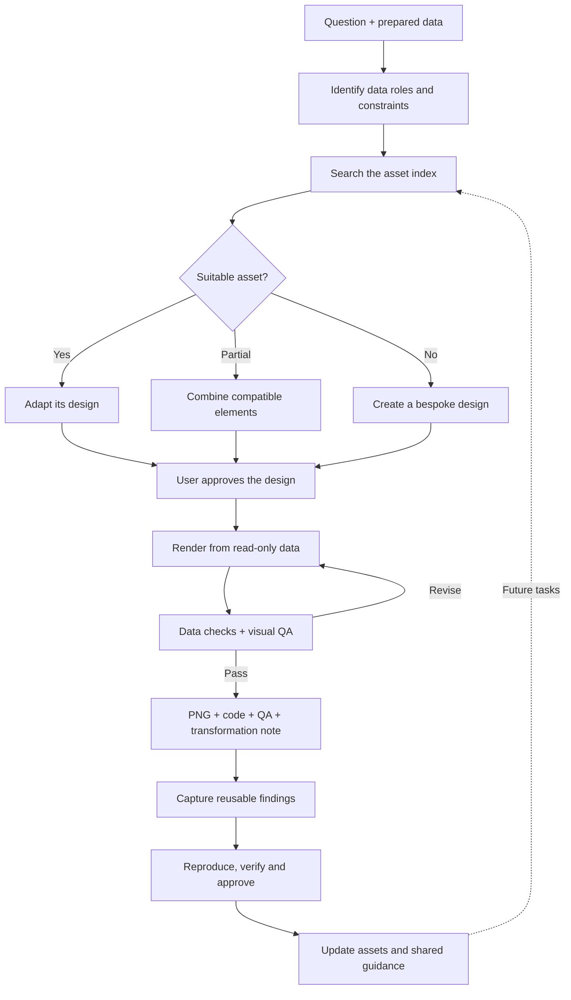

<div align="center">

<h1>Econfigure Skill</h1>

<p><strong>Clear, disciplined, reproducible figures for applied-economics master’s theses</strong></p>
<p>Approve the design. Render the figure. Reuse assets with room to adapt.</p>

<p>
<a href="LICENSE"></a>


</p>
<p><a href="#preview">Preview</a> · <a href="#project-focus">Focus</a> · <a href="#capabilities">Capabilities</a> · <a href="#figure-types">Figure types</a> · <a href="#workflow">Workflow</a> · <a href="#institution-templates">Templates</a> · <a href="#installation">Install</a> · <a href="#usage">Quick start</a> · <a href="#quality">Quality</a></p>
<p><a href="README.md">简体中文</a> | <a href="README_EN.md">English</a></p>
</div>

---

<!-- section:preview -->
<a id="preview"></a>

## See the output

<p align="center"><a href="assets/showcase/econfigure-skill-preview.png"></a></p>

Four examples use **explicitly synthetic data** to illustrate trends, group comparisons, coefficients and policy dynamics. Open the image for detail. Each example includes its input CSV, request, acceptance criteria and a 600 dpi PNG. These values are not empirical findings.

<details>
<summary>Explore the four full-size examples</summary>

| Trends | Group comparisons |
|---|---|
| [](assets/standard_samples/regional-export-trend/) | [](assets/standard_samples/ownership-productivity-comparison/) |
| Coefficients and intervals | Policy dynamics |
| [](assets/standard_samples/policy-coefficients/) | [](assets/standard_samples/event-study-dynamics/) |

</details>

[Browse all 67 assets →](assets/figure-atlas.md) · [Reproduce these examples →](assets/standard_samples/README.md)

<!-- section:project-focus -->
<a id="project-focus"></a>

## Make the economic question visible

Econfigure Skill is an Agent Skill for **applied-economics master’s thesis figures and tables**. Give the agent a research question and prepared data or estimation results. It proposes a figure design, waits for your approval, then adapts or writes code to deliver a reproducible PNG.

The primary goal is clear thesis communication and page-appropriate layout; journal submission is not the default. No institution, font or point size is fixed to JUFE conventions. Institution rules apply only when explicitly selected.

**You own the research decisions; the skill handles visual communication.** It does not estimate regressions, recalculate confidence intervals or construct research indicators. Supply evaluated curve data when a fitted line is required. Missing data that affect meaning must be resolved before rendering.

<!-- section:capabilities -->
<a id="capabilities"></a>

## Design principles and core capabilities

### Design principles

| Principle | Description |
|---|---|
| Question-led design | Select figures that communicate the comparisons and evidence required by the thesis question |
| Focused communication | Organize each figure around a central message, with a defined purpose for every panel |
| Visual consistency | Coordinate typographic hierarchy, color semantics and layout across a coherent set of figures |
| Faithful representation | Map visual encodings accurately to variables and statistics, preserving their meaning |
| Reproducibility | Define outputs through data, parameters and rendering code for repeatable production and revision |

### Core capabilities

| Capability | Description |
|---|---|
| Chart selection | Support trends, comparisons, composition, distributions, relationships, estimates and policy dynamics |
| Semantic asset retrieval | Filter by data roles, figure structure and visual elements, then inspect candidate data requirements |
| Copy-First code reuse | Adapt a matching production script and reuse its rendering and layout implementation |
| Cross-family composition | Combine compatible elements using semantic invariants, scalable ratios and logic switches; allow bespoke designs |
| Institution template adaptation | Apply typography, captions and table formatting from the selected institution package |
| Figure and table delivery | Produce 600 dpi PNG figures and Word three-line tables with QA and transformation notes |
| Staged quality validation | Apply five QA passes covering design, data, code, rendering and delivery, with asset execution tools |
| Reusable experience | Turn verified design patterns and corrections into retrievable assets, shared guidance and acceptance cases for future tasks |

<!-- section:figure-types -->
<a id="figure-types"></a>

## Figure type overview

Figure examples were collected from public academic literature and implemented in Python. Open previews for detail; see the [public atlas](assets/figure-atlas.md) for all assets and data requirements.

| Figure name | Preview | Visual characteristics | Typical applications |
|---|---|---|---|
| Line trends | <a href="assets/figures/line-trend/dual-series-trend-prediction-2panel.png"></a> | Ordered time axes, line and marker encoding, single or faceted layouts | Annual trends, two-series change, structural divergence |
| Intervals and bands | <a href="assets/figures/interval-band/irf-shaded-ci-2x3.png"></a> | Central paths with interval bands, nested intervals or multiple panels | Confidence intervals, impulse responses, quantile effects |
| Area charts | <a href="assets/figures/area-chart/stacked-area-portfolio-composition.png"></a> | Stacked continuous bands showing totals and components together | Composition over time and cumulative scale |
| Bar comparisons | <a href="assets/figures/bar-comparison/monotonic-vbar-value-labels.png"></a> | Bar-length encoding, category ordering, signed values and numeric labels | Ranking, signed change, standardized comparison |
| Grouped bars | <a href="assets/figures/grouped-bar/grouped-vbar-benchmark-2x2.png"></a> | Within-category grouped bars, series encoding and coordinated panels | Within-category groups and multi-panel benchmarks |
| Stacked bars | <a href="assets/figures/stacked-bar/decomposition-100pct-hbar-2x2.png"></a> | Segmented bars, absolute or percentage scales, paired compositions | Percentage composition, decomposition, paired stacks |
| Bars with error | <a href="assets/figures/bar-with-error/grouped-vbar-errorbars-three-treatments.png"></a> | Bars with uncertainty intervals, caps and comparison annotations | Group means with uncertainty and treatment comparisons |
| Scatter and relationship diagnostics | <a href="assets/figures/scatter-relationship/binscatter-diagnostic-2x2.png"></a> | Position-encoded points, grouped or binned scatter, optional supplied fitted paths | Bivariate relationships, binscatter, fit diagnostics |
| Distributions | <a href="assets/figures/distribution/crop-output-density-2x2.png"></a> | Frequency or density curves, overlaid groups and faceted comparisons | Density, frequency, baseline and endline distributions |
| Box and strip plots | <a href="assets/figures/box-plot/annual-boxplot-trend.png"></a> | Quartile boxes, median strokes, whiskers or individual observations | Group distributions, annual distributions, outliers |
| Coefficient plots | <a href="assets/figures/coefficient-plot/treatment-arm-domain-intervals.png"></a> | Point estimates and intervals, zero references, multiple models or outcomes | Regression coefficients, treatment comparisons, forest plots |
| Event studies | <a href="assets/figures/event-study/event-response-2x2-dashed-bounds.png"></a> | Relative event time, dynamic effects and intervals, policy timing and baseline markers | Pre/post policy dynamics and parallel-trend presentation |
| Heatmaps | <a href="assets/figures/heatmap/exposure-sales-diverging-heatmap.png"></a> | Matrix color encoding, sequential or diverging scales, row and column grouping | State-time matrices, exposure intensity, selection results |
| Waterfalls | <a href="assets/figures/waterfall/export-value-added-waterfall-2panel.png"></a> | Floating bars, signed contributions, cumulative endpoints and decomposition connectors | Index decomposition, signed contributions, cumulative totals |

<!-- section:workflow -->
<a id="workflow"></a>

## System workflow

Production follows these steps from the research question to delivery:

```text
User intent → Figure design → Code execution → Quality review → Delivery

Step 1  Interpret the request  | Identify the research question, displayed entities and intended use.
Step 2  Inspect the data  | Read fields, units, groups and time structure without modifying sources; identify required roles.
Step 3  Select the chart  | Choose the figure family and panel structure from the comparison goal and data structure.
Step 4  Match assets  | Find compatible assets and choose direct reuse, element composition or bespoke design.
Step 5  Approve the design  | Present data mappings, layout, encodings and formatting for user approval.
Step 6  Adapt the code  | Map user data, adapt production code and parameters, and record necessary transformations.
Step 7  Preflight and render  | Check dependencies, fonts and plotting data; render a 600 dpi PNG at the intended size.
Step 8  Validate quality  | Apply five QA passes to code and rendered output, correct failures and rerender.
Step 9  Deliver results  | Supply the final PNG, QA report and transformation note, retaining runnable code.
Step 10  Retain experience  | Reproduce, verify and approve reusable findings before updating assets and guidance.
```

<details>
<summary>View the workflow diagram</summary>



</details>

### Continuous accumulation of reusable experience

New design patterns and effective corrections can become reusable knowledge for later figure tasks. The skill follows this cycle:

**Capture → Reproduce and verify → Review and promote → Retrieve and reuse**

| Stage | Result |
|---|---|
| Capture | Record conditions, causes, corrections and exceptions; scope the finding to an asset, family or shared rule |
| Reproduce and verify | Validate with a minimal synthetic fixture and retain relevant QA results and acceptance cases |
| Review and promote | After maintenance approval, update production assets, semantic guidance or shared references, then refresh the index and atlas |
| Retrieve and reuse | Future tasks access verified experience through asset tags and topic references, reducing repeated trial and error |

This is an agent-executed, reviewed knowledge-maintenance mechanism. Candidates stay in the user's workspace; the public skill retains generalized methods and redistributable fixtures. See the [experience lifecycle](references/experience-learning.md).

<!-- section:institution-templates -->
<a id="institution-templates"></a>

## Institution templates

School packages live under [`assets/institution-templates/`](assets/institution-templates/README.md). Every package is an **explicit opt-in** and never a global default.

The repository includes a Jiangxi University of Finance and Economics master's thesis [machine configuration](assets/institution-templates/jiangxi-university-of-finance-and-economics/template.yaml), [usage guide](assets/institution-templates/jiangxi-university-of-finance-and-economics/README.md), and original Word template. Tell the agent to use the JUFE package or supply your own document. A user-supplied document overrides conflicting bundled values.

To add another school, copy `assets/institution-templates/_template/`, use a kebab-case English directory name, and record the authoritative source, fonts, sizes, caption placement, table rules, and scope. Bundle the original file only when redistribution is permitted.

<!-- section:installation -->
<a id="installation"></a>

## Installation

Download this repository as a ZIP and name the extracted **complete directory** `econfigure`. Place it as below; do not copy only `SKILL.md`. Platforms use different instruction mechanisms: these are native-skill or rule-adapter entry points, and automatic invocation depends on the client version.

| Agent | Placement and activation | Guide |
|---|---|---|
| Claude Code | `.claude/skills/econfigure/` · `/econfigure` | [Claude Code](install/claude-code/INSTALL.md) |
| Codex | `.agents/skills/econfigure/` · `$econfigure` | [Codex](install/codex/INSTALL.md) |
| Cursor | `.ai/econfigure-skill/` + `.cursor/rules/econfigure.mdc` | [Cursor rule](install/cursor/econfigure.mdc) |
| GitHub Copilot | `.ai/econfigure-skill/` + `.github/copilot-instructions.md` | [Copilot instructions](install/copilot/copilot-instructions.md) |

Paths above are relative to your working project. Merge existing Copilot instructions instead of overwriting them. From the skill root, create a Python environment and install dependencies:

```bash
python -m venv .venv
# macOS / Linux
source .venv/bin/activate
# Windows PowerShell: .venv\Scripts\Activate.ps1
python -m pip install -r requirements.txt
```

Python 3.11 is recommended. Chinese figures require installed CJK fonts; institution packages may require additional specified fonts. 


Installation references: [Claude Code](https://code.claude.com/docs/en/skills) · [Codex](https://developers.openai.com/codex/skills/) · [Cursor](https://cursor.com/docs/rules) · [GitHub Copilot](https://code.visualstudio.com/docs/agent-customization/custom-instructions).

<!-- section:usage -->
<a id="usage"></a>

## Quick start

Place the data in your working project and tell the agent what the figure should answer:

```text
Use Econfigure Skill to compare export-growth trends across three regions
from exports.csv. The data are already prepared. Propose a design suitable
for a master’s thesis, then produce a PNG, runnable code and QA notes after approval.
```

For estimation results, specify intervals and reference groups. Select an institution package explicitly when needed:

```text
Use Econfigure Skill with the JUFE package. In results.csv, estimate, low
and high contain coefficients and precomputed 95% confidence intervals.
The notes identify reference groups. Create a coefficient plot without re-estimation.
```

To reproduce the examples without an agent:

```bash
python scripts/render_standard_samples.py --showcase
```

Outputs appear in `assets/standard_samples/`; the combined homepage preview appears in `assets/showcase/`.

<!-- section:quality -->
<a id="quality"></a>

## Quality evaluation and testing

### Five-pass QA protocol

| Pass | Name | Checks | Coverage |
|---|---|---:|---|
| Pass 0 | Design review (RD) | 7 | Communication goal, chart suitability, approval, implementation route, asset evidence and prohibited forms |
| Pass 1 | Data boundary and feasibility (RF) | 14 | Source integrity, fields and units, transformation records, time coverage, baselines, intervals and composition |
| Pass 2 | Implementation (RI) | 9 | Asset reuse, element composition, data/render separation, paths, determinism and execution status |
| Pass 3 | Render validation (RV) | 22 | PNG specifications, dimensions, glyphs, axes, legends, annotations, panel consistency and readability |
| Pass 4 | Delivery review (DL) | 6 | Communication, claim boundaries, thesis-caption separation, document consistency, naming and accompanying reports |

The protocol contains **58 checks**; see the [complete QA specification](references/qa-real-use.md). Record each as `PASS`, `FAIL`, `WARN` or `N/A`: resolve failures before delivery, document warning dispositions and explain inapplicable checks. The agent applies QA using data, code and rendered figures; evaluation tools automate their explicitly defined checks.

### Run evaluations

```bash
# Full-library evaluation: manifests, data roles and script execution
python scripts/eval_runner.py --execute

# One figure family
python scripts/eval_runner.py --execute --family heatmap

# One asset
python scripts/eval_runner.py --execute --asset annual-boxplot-trend

# Standard samples: rendering, input integrity and output specifications
python scripts/render_standard_samples.py --output-dir ./sample-output

# Data-gate tests
python -m unittest discover -s tests -p "test_*.py"

# Core figure and Word three-line-table integration test
python tests/smoke_test.py
```

Without `--execute`, asset evaluation checks manifest structure, data-column role coverage and file references only. Standard samples cover trends, grouped comparisons, coefficients and event studies. Visual and semantic checks follow the QA protocol above.

<!-- section:structure -->
<a id="structure"></a>

## Project structure

The package contains the skill entry point, shared knowledge, production assets, rendering components and runtime tools:

```text
econfigure/                                                ← Econfigure Skill package
├── .github/                                               ← Collaboration templates and continuous integration
│   ├── ISSUE_TEMPLATE/                                    ← Issue and feature templates
│   │   ├── bug_report.yml                                 ← Bug report template
│   │   └── feature_request.yml                            ← Feature request template
│   ├── workflows/                                         ← Continuous integration configuration
│   │   └── ci.yml                                         ← Automated validation workflow
│   └── pull_request_template.md                           ← Pull request template
├── agents/                                                ← Agent interface configuration
│   └── openai.yaml                                        ← Codex display name, description and invocation prompt
├── assets/                                                ← Figure assets, templates and samples
│   ├── figures/                                           ← Figure scripts, previews, fixtures and semantic manifests
│   │   ├── area-chart/                                    ← Area charts
│   │   ├── bar-comparison/                                ← Bar comparisons
│   │   ├── bar-with-error/                                ← Bars with error intervals
│   │   ├── box-plot/                                      ← Box and strip plots
│   │   ├── coefficient-plot/                              ← Coefficient plots
│   │   ├── distribution/                                  ← Distribution plots
│   │   ├── event-study/                                   ← Event studies
│   │   ├── grouped-bar/                                   ← Grouped bars
│   │   ├── heatmap/                                       ← Heatmaps
│   │   ├── interval-band/                                 ← Intervals and bands
│   │   ├── line-trend/                                    ← Line trends
│   │   ├── scatter-relationship/                          ← Scatter and relationship diagnostics
│   │   ├── stacked-bar/                                   ← Stacked bars
│   │   └── waterfall/                                     ← Waterfalls
│   ├── institution-templates/                             ← Optional institution thesis packages
│   │   ├── _template/                                     ← Starter package for another institution
│   │   │   └── template.yaml                              ← Template source, formatting parameters and scope
│   │   ├── jiangxi-university-of-finance-and-economics/   ← JUFE template package
│   │   │   ├── README.md                                  ← Directory usage guide
│   │   │   ├── jufe-master-thesis-template.doc            ← Institution Word template file
│   │   │   └── template.yaml                              ← Template source, formatting parameters and scope
│   │   └── README.md                                      ← Directory usage guide
│   ├── showcase/                                          ← Homepage showcase
│   │   └── econfigure-skill-preview.png                   ← Combined homepage preview
│   ├── standard_samples/                                  ← Synthetic data and reproducible standard samples
│   │   ├── event-study-dynamics/                          ← Policy dynamics example
│   │   ├── ownership-productivity-comparison/             ← Ownership and productivity example
│   │   ├── policy-coefficients/                           ← Policy coefficient example
│   │   ├── regional-export-trend/                         ← Regional export-growth example
│   │   ├── README.md                                      ← Directory usage guide
│   │   └── sample.schema.yaml                             ← Standard sample field specification
│   ├── asset.schema.yaml                                  ← Individual asset manifest field specification
│   ├── catalog.index.yaml                                 ← Machine index for candidate filtering
│   ├── catalog.schema.yaml                                ← Machine index field specification
│   └── figure-atlas.md                                    ← Complete public atlas
├── chartlib/                                              ← Shared rendering and data components
│   ├── __init__.py                                        ← Package initialization and runtime cache setup
│   ├── asset_runtime.py                                   ← Asset execution and export utilities
│   ├── comparison_renderers.py                            ← Comparison figure renderers
│   ├── data_io.py                                         ← Data loading and AuditLog transformation records
│   ├── env_check.py                                       ← Dependency and font environment checks
│   ├── figures.py                                         ← Core figure rendering interfaces
│   ├── inference_renderers.py                             ← Estimate and interval renderers
│   ├── matrix_decomposition_renderers.py                  ← Matrix and decomposition renderers
│   ├── savefig.py                                         ← PNG export and delivery prompts
│   └── tables.py                                          ← Word three-line table generation
├── install/                                               ← Cross-platform installation and routing adapters
│   ├── claude-code/                                       ← Claude Code native skill installation
│   │   └── INSTALL.md                                     ← Platform installation instructions
│   ├── codex/                                             ← Codex native skill installation
│   │   └── INSTALL.md                                     ← Platform installation instructions
│   ├── copilot/                                           ← GitHub Copilot instruction adapter
│   │   └── copilot-instructions.md                        ← Copilot skill routing instructions
│   ├── cursor/                                            ← Cursor project rule adapter
│   │   └── econfigure.mdc                                 ← Cursor skill routing rule
│   └── README.md                                          ← Directory usage guide
├── references/                                            ← Shared knowledge loaded by task
│   ├── asset-engineering.md                               ← Asset creation, updates and promotion
│   ├── asset-provenance.md                                ← Literature asset provenance and rights
│   ├── asset-retrieval.md                                 ← Two-level retrieval and candidate matching
│   ├── color-palettes.md                                  ← Color semantics and visual discrimination
│   ├── common-pitfalls.md                                 ← Common plotting pitfalls and remedies
│   ├── experience-learning.md                             ← Experience capture, verification, promotion and reuse
│   ├── figure-deconstruction.md                           ← Visual element analysis and cross-asset composition
│   ├── institution-templates.md                           ← Institution template selection and application
│   ├── parameter-system.md                                ← Semantic invariants, scalable ratios and logic switches
│   ├── qa-asset.md                                        ← Reusable asset acceptance protocol
│   ├── qa-real-use.md                                     ← Figure QA: five passes and reporting requirements
│   ├── real-use-workflow.md                               ← Figure production workflow and delivery steps
│   ├── typography-layout.md                               ← Typographic hierarchy and layout
│   └── workflow-router.md                                 ← Route figure, table, template and asset tasks
├── scripts/                                               ← Retrieval index, atlas and evaluation tools
│   ├── build_catalog.py                                   ← Build or check the machine retrieval index
│   ├── eval_runner.py                                     ← Full-library, family or single-asset evaluation
│   ├── generate_atlas.py                                  ← Build or check the public atlas
│   ├── generate_showcase.py                               ← Homepage showcase generation entry point
│   ├── release_check.py                                   ← Maintenance tool: release-file consistency checks
│   └── render_standard_samples.py                         ← Standard sample rendering and data checks
├── styles/                                                ← Matplotlib visual baselines
│   ├── base.mplstyle                                      ← Shared base style
│   └── figure.mplstyle                                    ← Figure style configuration
├── tests/                                                 ← Component and data-gate tests
│   ├── sample_data.csv                                    ← Component test fixture
│   ├── smoke_test.py                                      ← Core figure, PNG and Word table smoke test
│   └── test_sample_guards.py                              ← Invalid-data rejection tests
├── .editorconfig                                          ← Editor formatting conventions
├── .gitattributes                                         ← File attributes and line endings
├── .gitignore                                             ← Exclude local environments and runtime outputs
├── CHANGELOG.md                                           ← Version history
├── CONTRIBUTING.md                                        ← Contribution requirements and maintenance validation
├── LICENSE                                                ← Apache-2.0 license
├── NOTICE                                                 ← Copyright and third-party notices
├── README.md                                              ← Chinese project documentation
├── README_EN.md                                           ← English project documentation
├── SECURITY.md                                            ← Security reporting guidance
├── SKILL.md                                               ← Skill entry point and workflow routing
└── requirements.txt                                       ← Python runtime dependencies
```

Within each figure-family directory, an asset contains matching `.py`, `.png`, `.asset.yaml` and accompanying `.fixture.csv` files; some assets include additional panel or annotation data. Each standard-sample directory contains `request.md`, `input.csv`, `expected.yaml` and `figure.png`.

<!-- section:provenance -->
<a id="provenance"></a>

## Asset provenance and rights

The figure library is not the author's private asset collection. The author collected figure examples from publicly accessible academic literature, studied their communication structure, and reimplemented them as executable code. Apache-2.0 covers original project code and documentation; it does not relicense original papers, figures, research results, or school templates. See [NOTICE](NOTICE) and [asset-provenance.md](references/asset-provenance.md).

<!-- section:contributing -->
<a id="contributing"></a>

## Contributing

A figure contribution must include a production script, redistributable fixture, script-generated PNG, asset manifest, and complete semantic contract, and it must pass the full-library audit. See [CONTRIBUTING.md](CONTRIBUTING.md).

<!-- section:license -->
<a id="license"></a>

## License

Original project code and documentation are available under the [Apache License 2.0](LICENSE). Third-party literature, original figures, and institution templates are not automatically covered by that license.
