# Econfigure Skill Public Figure Atlas

> This file is generated from public runtime manifests. Run `python scripts/generate_atlas.py` after changing an asset manifest.

The library contains independently implemented figure assets collected and studied from publicly accessible academic literature. Original publications and their figures remain the property of their respective authors and publishers. The atlas is a retrieval index, not a claim of ownership over the underlying visual ideas.

**Assets:** 67  
**Families:** 14

## Family index

| Family | Assets |
|---|---:|
| [area-chart](#area-chart) | 3 |
| [bar-comparison](#bar-comparison) | 3 |
| [bar-with-error](#bar-with-error) | 3 |
| [box-plot](#box-plot) | 6 |
| [coefficient-plot](#coefficient-plot) | 8 |
| [distribution](#distribution) | 4 |
| [event-study](#event-study) | 7 |
| [grouped-bar](#grouped-bar) | 5 |
| [heatmap](#heatmap) | 4 |
| [interval-band](#interval-band) | 4 |
| [line-trend](#line-trend) | 6 |
| [scatter-relationship](#scatter-relationship) | 8 |
| [stacked-bar](#stacked-bar) | 4 |
| [waterfall](#waterfall) | 2 |

## area-chart

### stacked-area-national-assets

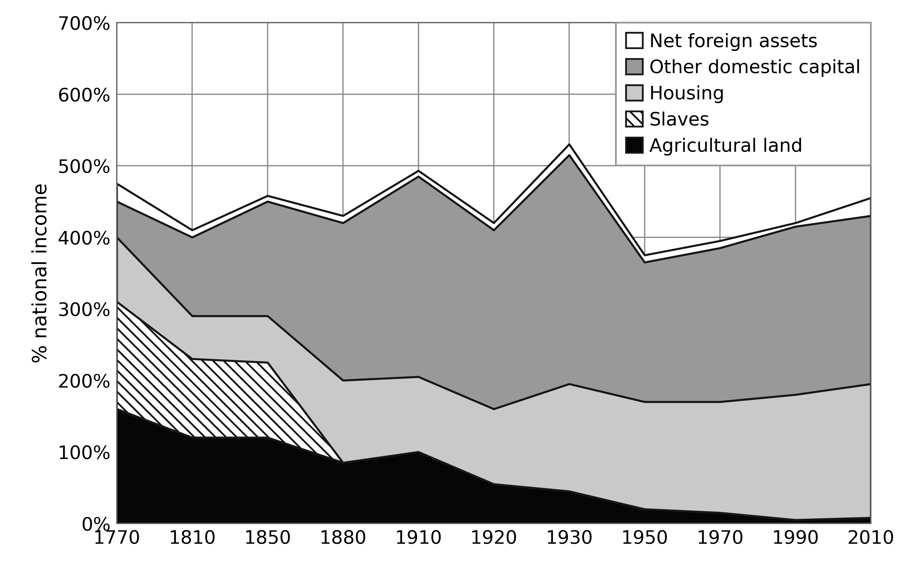

- **Subtype:** `grayscale-five-component-historical-stack`
- **Use when:** Show how the composition and total scale of national assets change over time; Preserve a historically disappearing component with hatch encoding
- **Required fields:** `component, component_order, value, year, year_order`
- **Data meaning:** stacked vertical thickness encodes component magnitude or share
- **Tags:** `black, categorical-year-spacing, diagonal-hatch, five-components, grayscale-safe, historical-profile, large-inset-legend, light-gray, medium-gray, percent-of-national-income-y, single-panel, stacked-area, tickless-labeled-axes, two-direction-grid, white-outline, wide-landscape`
- **Code:** [`stacked-area-national-assets.py`](figures/area-chart/stacked-area-national-assets.py)

### stacked-area-portfolio-composition

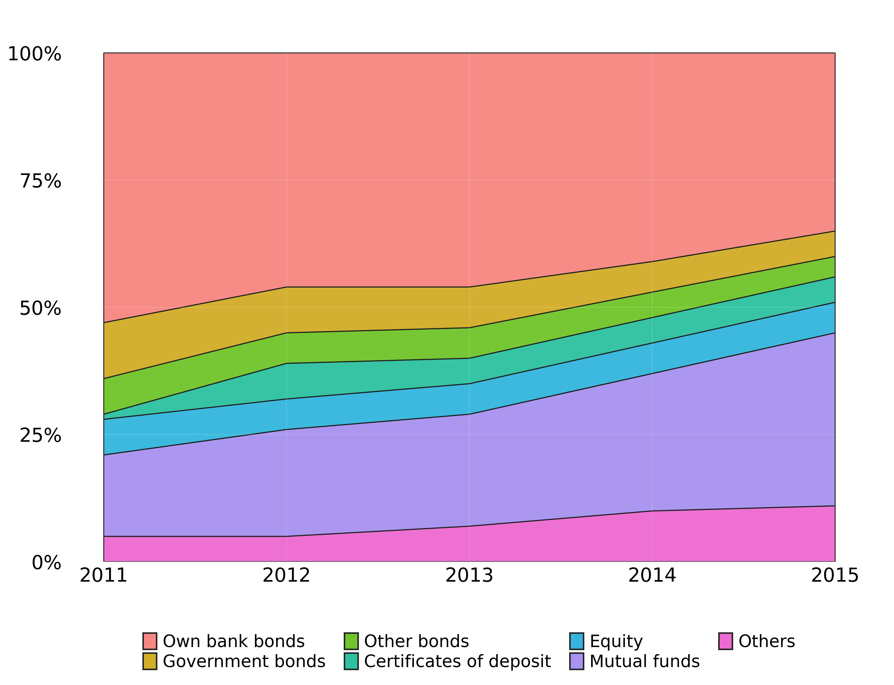

- **Subtype:** `normalized-seven-component-portfolio-profile`
- **Use when:** Compare changes in portfolio composition over time; Show simultaneous growth and contraction across seven asset classes
- **Required fields:** `component, component_order, share, year`
- **Data meaning:** stacked vertical thickness encodes component magnitude or share
- **Tags:** `annual, continuous-year-x, dark-boundaries, external-bottom-legend, normalized, percent-y, seven-color-fill, seven-components, single-panel, stacked-area, tickless-labeled-axes, two-row-bottom-legend, wide-landscape`
- **Code:** [`stacked-area-portfolio-composition.py`](figures/area-chart/stacked-area-portfolio-composition.py)

> Specialized constraint: Validate the declared denominator and require each displayed whole to sum to 100% within tolerance.

### stacked-area-round-outcomes

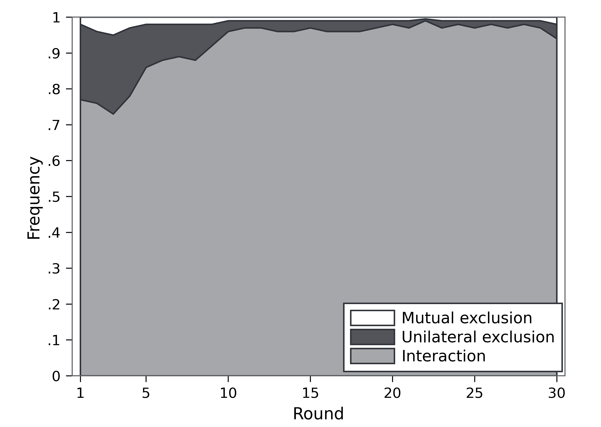

- **Subtype:** `normalized-three-outcome-round-profile`
- **Use when:** Track convergence in outcome composition across repeated rounds; Emphasize a dominant interaction share and shrinking exclusion shares
- **Required fields:** `component, component_order, round, share`
- **Data meaning:** stacked vertical thickness encodes component magnitude or share
- **Tags:** `compact-landscape, continuous-round-x, dark-gray, frequency-y, full-frame, grayscale-safe, inset-bottom-right-legend, light-gray, normalized, single-panel, stacked-area, thirty-rounds, three-components, white`
- **Code:** [`stacked-area-round-outcomes.py`](figures/area-chart/stacked-area-round-outcomes.py)

> Specialized constraint: Validate the declared denominator and require each displayed whole to sum to 100% within tolerance.

## bar-comparison

### diverging-hbar-zscore-2panel

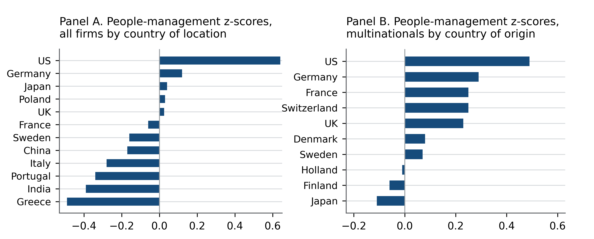

- **Subtype:** `two-panel-diverging-horizontal-bars`
- **Use when:** Compare standardized scores across countries; Contrast two samples with separate category sets
- **Required fields:** `category, category_order, panel, panel_order, value`
- **Data meaning:** bar length or height encodes magnitude from a zero baseline
- **Tags:** `category-y, diverging, horizontal-bar, left-aligned-panel-titles, long-label-margin, side-by-side-panels, signed-x, single-navy-fill, two-panel, vertical-grid, zero-lines`
- **Code:** [`diverging-hbar-zscore-2panel.py`](figures/bar-comparison/diverging-hbar-zscore-2panel.py)

### monotonic-vbar-value-labels

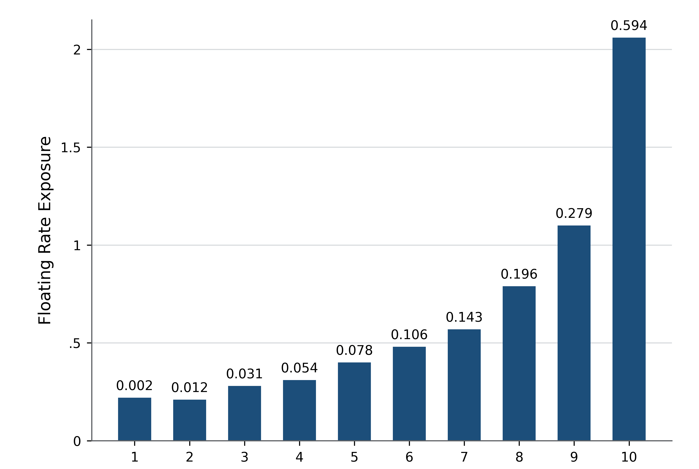

- **Subtype:** `ordered-single-series-bars-with-independent-labels`
- **Use when:** Show a strongly increasing ordered exposure profile; Display a second supplied statistic above each bar
- **Required fields:** `category, label, order, value`
- **Data meaning:** bar length or height encodes magnitude from a zero baseline
- **Tags:** `bar-top-labels, compact-landscape, horizontal-grid, independent-label-values, monotonic-profile, ordered-category-x, single-panel, single-series, uniform-navy-fill, vertical-bar, zero-baseline`
- **Code:** [`monotonic-vbar-value-labels.py`](figures/bar-comparison/monotonic-vbar-value-labels.py)

### negative-bar-sector-change

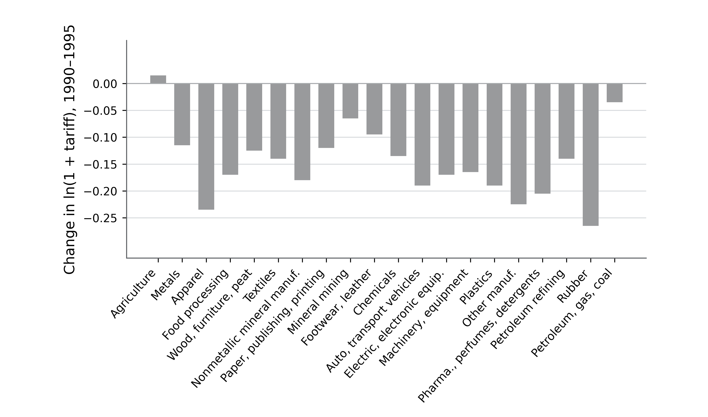

- **Subtype:** `signed-negative-vertical-bars`
- **Use when:** Compare signed changes across many sectors; Emphasize the magnitude of mostly negative category changes
- **Required fields:** `category, order, value`
- **Data meaning:** bar length or height encodes magnitude from a zero baseline
- **Tags:** `categorical-x, horizontal-grid, many-categories, rotated-category-labels, signed-y, single-series, uniform-gray-fill, vertical-bar, wide-bottom-label-margin, zero-line`
- **Code:** [`negative-bar-sector-change.py`](figures/bar-comparison/negative-bar-sector-change.py)

## bar-with-error

### grouped-vbar-errorbars-2series

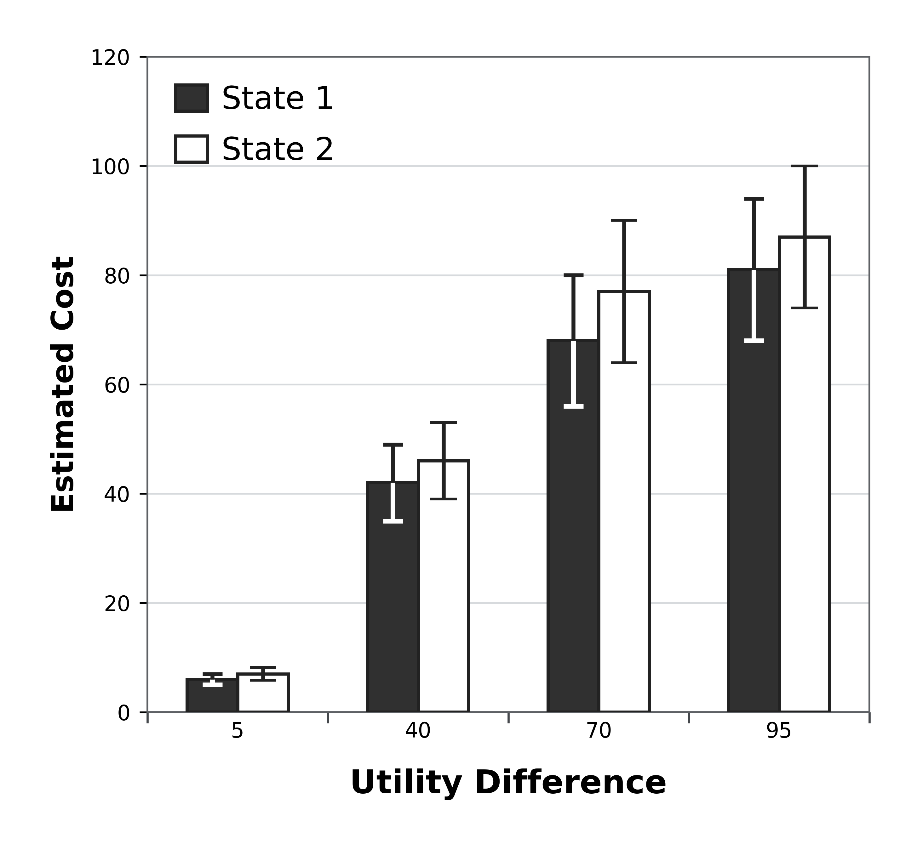

- **Subtype:** `two-series-grouped-bars-with-symmetric-errors`
- **Use when:** Compare estimated costs between two states; Show uncertainty around grouped estimates across an ordered parameter
- **Required fields:** `category_order, error, estimate, series, series_order, utility_difference`
- **Data meaning:** bar height encodes magnitude; whiskers encode supplied uncertainty
- **Tags:** `black-filled, capped-error-bars, error-bars, grayscale-safe, grouped, horizontal-grid, near-square, ordered-parameter-x, single-panel, top-left-legend, two-series, vertical-bar, white-outline, zero-baseline`
- **Code:** [`grouped-vbar-errorbars-2series.py`](figures/bar-with-error/grouped-vbar-errorbars-2series.py)

### grouped-vbar-errorbars-three-treatments

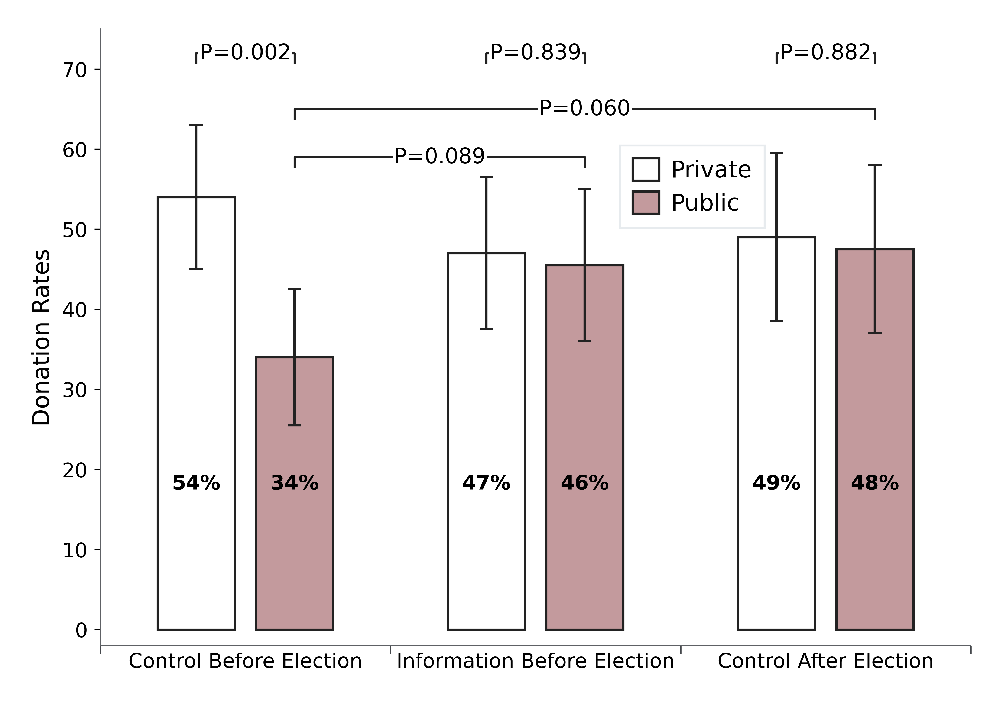

- **Subtype:** `three-treatment-two-sector-bars-with-symmetric-errors`
- **Use when:** Compare two institutional groups across three election-information treatments; Show uncertainty and supplied between-group significance tests
- **Required fields:** `display_label, error, estimate, group, group_order, treatment, treatment_order, within_p`
- **Data meaning:** bar height encodes magnitude; whiskers encode supplied uncertainty
- **Tags:** `black-errorbars, categorical-x, cross-treatment-brackets, donation-rate-y, error-bars, grouped, in-bar-percent-labels, muted-rose-public, reserved-top-annotation-band, single-panel, three-treatments, two-series, vertical-bar, white-private, wide-landscape, within-treatment-p-values, zero-baseline`
- **Code:** [`grouped-vbar-errorbars-three-treatments.py`](figures/bar-with-error/grouped-vbar-errorbars-three-treatments.py)

### lease-length-distribution-discount

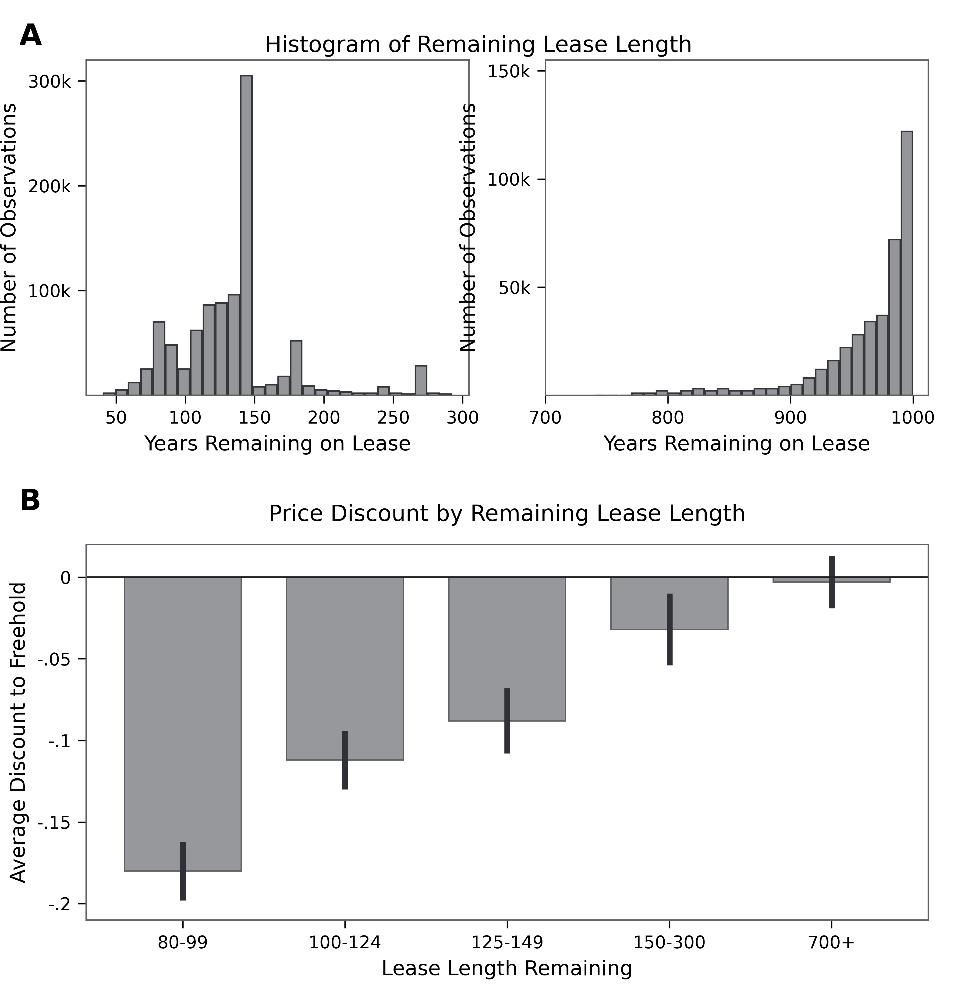

- **Subtype:** `split-range-histograms-and-negative-summary-bars`
- **Use when:** Show a discontinuous long-tailed lease distribution; Relate lease-length groups to average discounts and uncertainty
- **Required fields:** `error, label, order, panel, value, width, x`
- **Data meaning:** bar height encodes magnitude; whiskers encode supplied uncertainty
- **Tags:** `asymmetric-panel-width, count-y, dark-outlines, error-bars, histogram, lower-panel-title, negative-bars, negative-discount-y, panel-letters, shared-top-title, split-x-range, thick-uncertainty-lines, three-panels, two-top-one-bottom, uniform-gray, years-x, zero-reference`
- **Code:** [`lease-length-distribution-discount.py`](figures/bar-with-error/lease-length-distribution-discount.py)

## box-plot

### annual-boxplot-trend

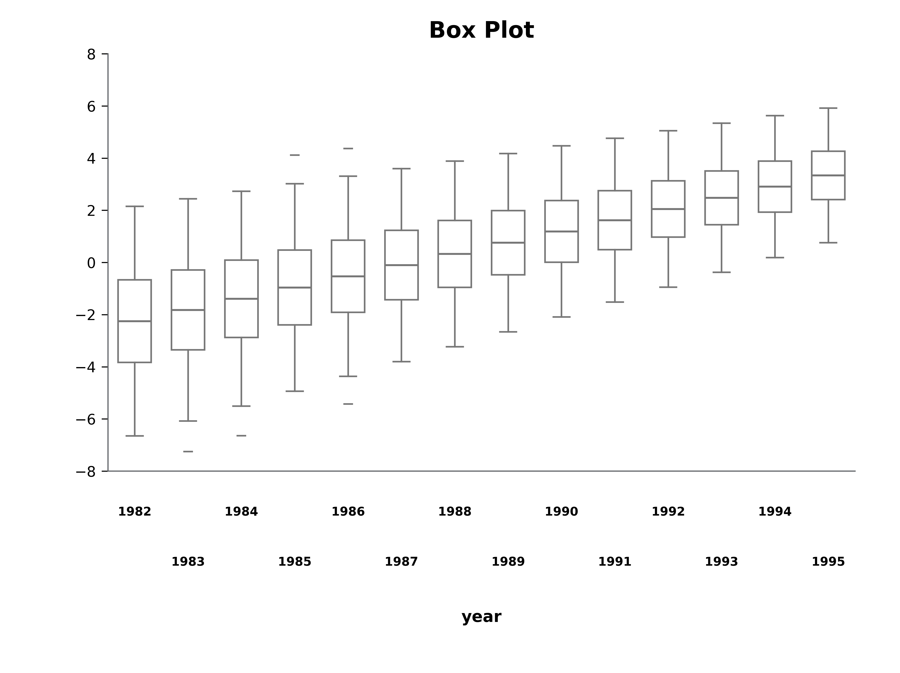

- **Subtype:** `annual-five-number-summary-sequence`
- **Use when:** Track distribution location and spread over years; Identify annual tail observations
- **Required fields:** `high, low, median, outlier_high, outlier_low, q1, q3, year`
- **Data meaning:** box, median, whiskers, and outliers encode distinct distribution summaries
- **Tags:** `alternating-year-labels, annual-sequence, boxplot, continuous-y, gray-outline, landscape, outliers, single-panel, whiskers, white-box, year-x`
- **Code:** [`annual-boxplot-trend.py`](figures/box-plot/annual-boxplot-trend.py)

### annual-return-stripplot

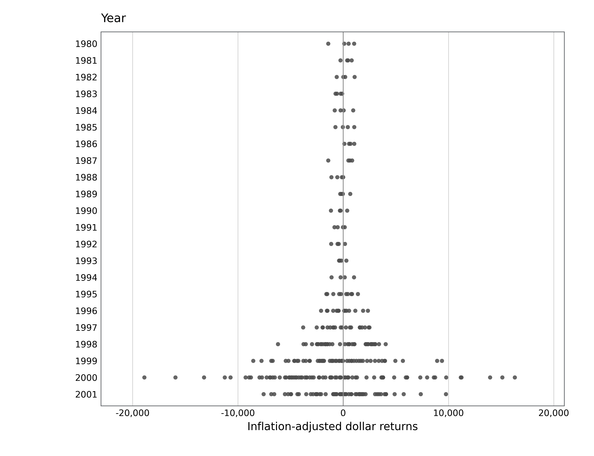

- **Subtype:** `annual-horizontal-return-distribution`
- **Use when:** Track cross-sectional return dispersion by year; Reveal years with unusually wide positive and negative tails
- **Required fields:** `return_value, year`
- **Data meaning:** box, median, whiskers, and outliers encode distinct distribution summaries
- **Tags:** `annual-rows, currency-x, dark-gray-points, portrait, reversed-year-y, single-panel, stripplot, top-left-axis-title, vertical-grid, zero-reference`
- **Code:** [`annual-return-stripplot.py`](figures/box-plot/annual-return-stripplot.py)

### importance-boxplot-outliers

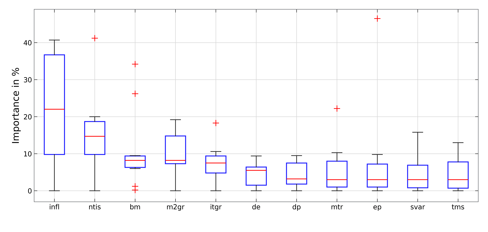

- **Subtype:** `eleven-predictor-importance-with-outliers`
- **Use when:** Compare variable-importance distributions across predictors; Identify predictors with large positive outliers
- **Required fields:** `high, kind, label, low, median, q1, q3`
- **Data meaning:** box, median, whiskers, and outliers encode distinct distribution summaries
- **Tags:** `blue-box-outline, boxplot, categorical-x, category-labels, eleven-categories, full-frame, importance-percent-y, outliers, red-median, red-plus-outlier, single-panel, whiskers, wide-landscape`
- **Code:** [`importance-boxplot-outliers.py`](figures/box-plot/importance-boxplot-outliers.py)

### investment-manager-compensation-boxplot

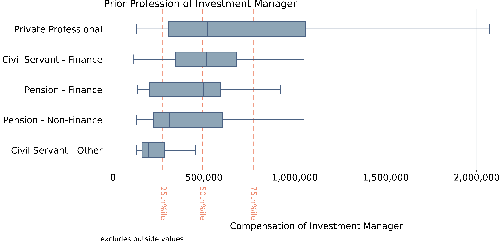

- **Subtype:** `five-profession-compensation-distributions`
- **Use when:** Compare compensation distribution across professions; Relate quartiles to named external percentiles
- **Required fields:** `high, label, low, median, order, q1, q3`
- **Data meaning:** box, median, whiskers, and outliers encode distinct distribution summaries
- **Tags:** `blue-gray-box, compensation-x, horizontal-boxplot, median, orange-dashed-guides, percentile-guides, profession-y, rotated-percentile-labels, single-wide-panel, source-note, whiskers`
- **Code:** [`investment-manager-compensation-boxplot.py`](figures/box-plot/investment-manager-compensation-boxplot.py)

### model-distribution-boxplots-6panel

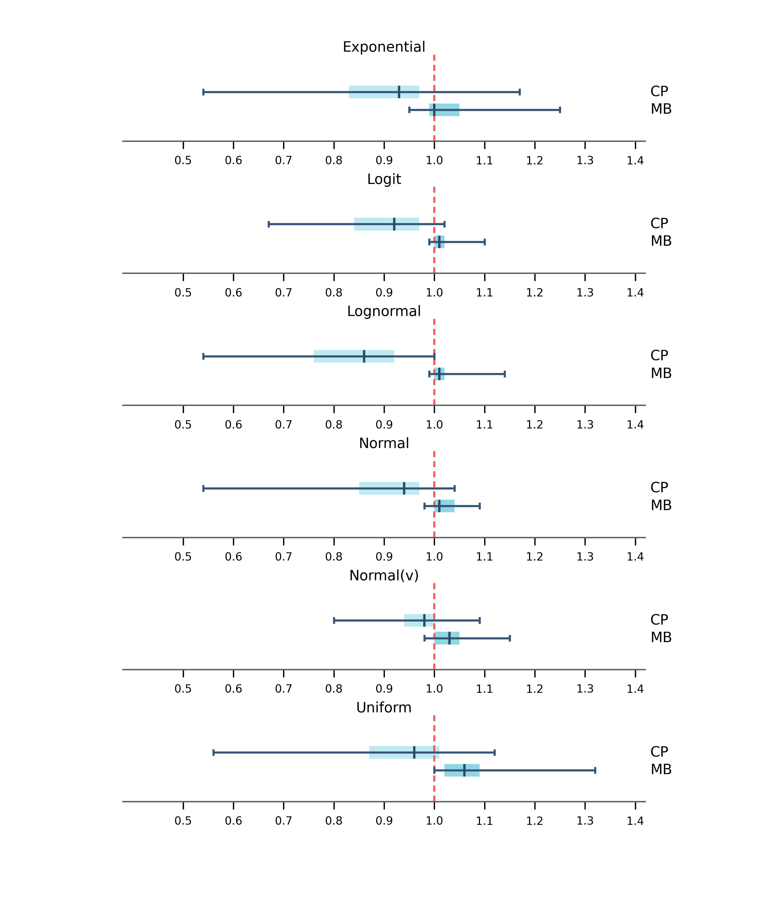

- **Subtype:** `six-model-two-group-distribution-summaries`
- **Use when:** Compare distribution location spread and skewness across model assumptions; Compare CP and MB distribution summaries within each model; Inspect whether medians and central ranges lie above or below a unit benchmark
- **Required fields:** `group, high, low, median, model, q1, q3`
- **Data meaning:** ['Blue rectangle spans q1 to q3; width is the interquartile range, not a confidence interval.', 'Short internal vertical stroke is the supplied median.', 'Whiskers terminate at supplied low and high; no Tukey fence or extrema convention is assumed.', 'Rectangle height and row spacing are layout parameters with no statistical magnitude meaning.', 'Vertical reference at x=1 represents the benchmark; confirm its meaning and units before reuse.']
- **Tags:** `cyan-iqr-box, dark-blue-whisker, dark-median-line, horizontal-boxplot, interquartile-box, median-tick, model-titles, portrait, red-unit-reference, reference-at-one, right-side-group-labels, shared-ratio-x, six-panels, six-rows, two-groups, whiskers`
- **Code:** [`model-distribution-boxplots-6panel.py`](figures/box-plot/model-distribution-boxplots-6panel.py)

> Specialized constraint: Confirm what CP and MB represent and how whisker endpoints were defined. Do not infer quartiles or whiskers from confidence-interval data.

### variance-decomposition-frequency-boxplots-2panel

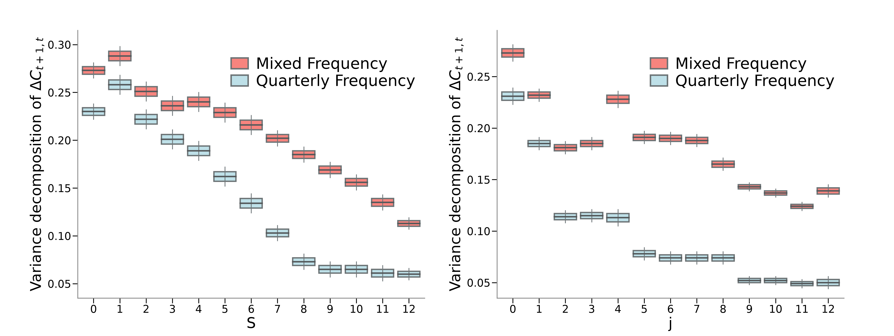

- **Subtype:** `mixed-versus-quarterly-frequency-variance-decomposition`
- **Use when:** Compare frequency-specific variance decomposition sequences; Inspect declining distribution summaries over positions
- **Required fields:** `frequency, high, low, median, panel, q1, q3, x`
- **Data meaning:** box, median, whiskers, and outliers encode distinct distribution summaries
- **Tags:** `cyan-fill, frequency-legend, one-by-two, paired-boxplots, position-x, salmon-fill, two-panels, variance-y`
- **Code:** [`variance-decomposition-frequency-boxplots-2panel.py`](figures/box-plot/variance-decomposition-frequency-boxplots-2panel.py)

## coefficient-plot

### drug-characteristics-coefficients-2panel

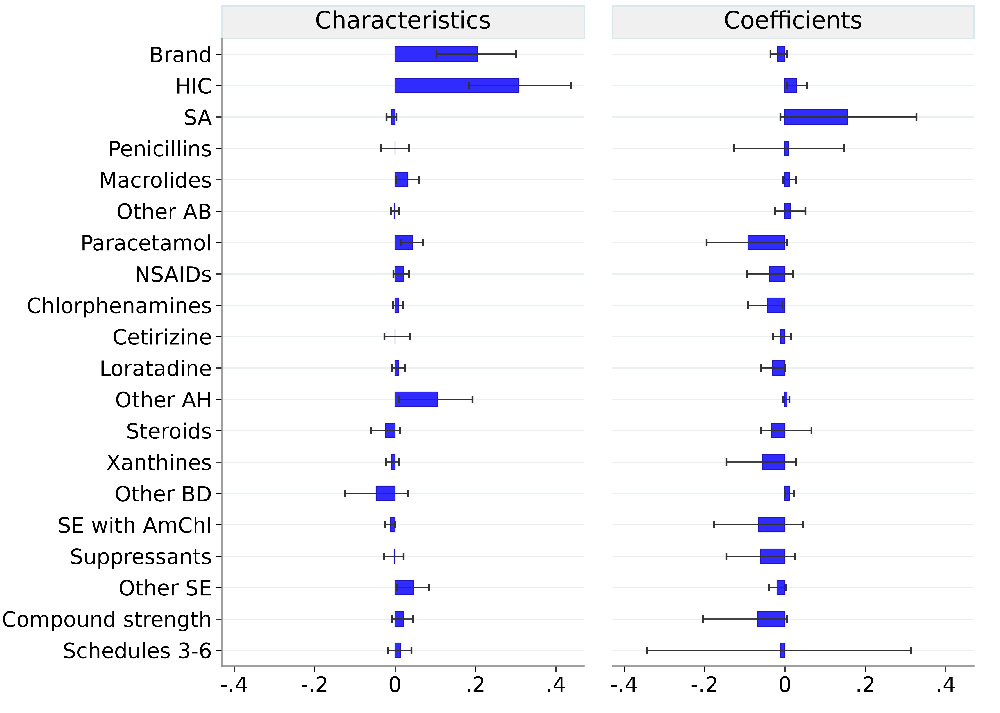

- **Subtype:** `aligned-drug-characteristics-and-coefficient-columns`
- **Use when:** Compare two coefficient sets on shared category rows; Identify category-specific effects and uncertainty
- **Required fields:** `estimate, high, label, low, order, panel`
- **Data meaning:** point position encodes the estimate and whiskers encode supplied lower and upper limits
- **Tags:** `aligned-two-panels, black-interval, blue-bar, coefficient-x, column-header-strip, confidence-interval, horizontal-bars-from-zero, one-by-two, shared-category-y`
- **Code:** [`drug-characteristics-coefficients-2panel.py`](figures/coefficient-plot/drug-characteristics-coefficients-2panel.py)

> Specialized constraint: Estimate and every displayed interval boundary must be supplied on identical keys.

### host-refugee-coefficients-2panel

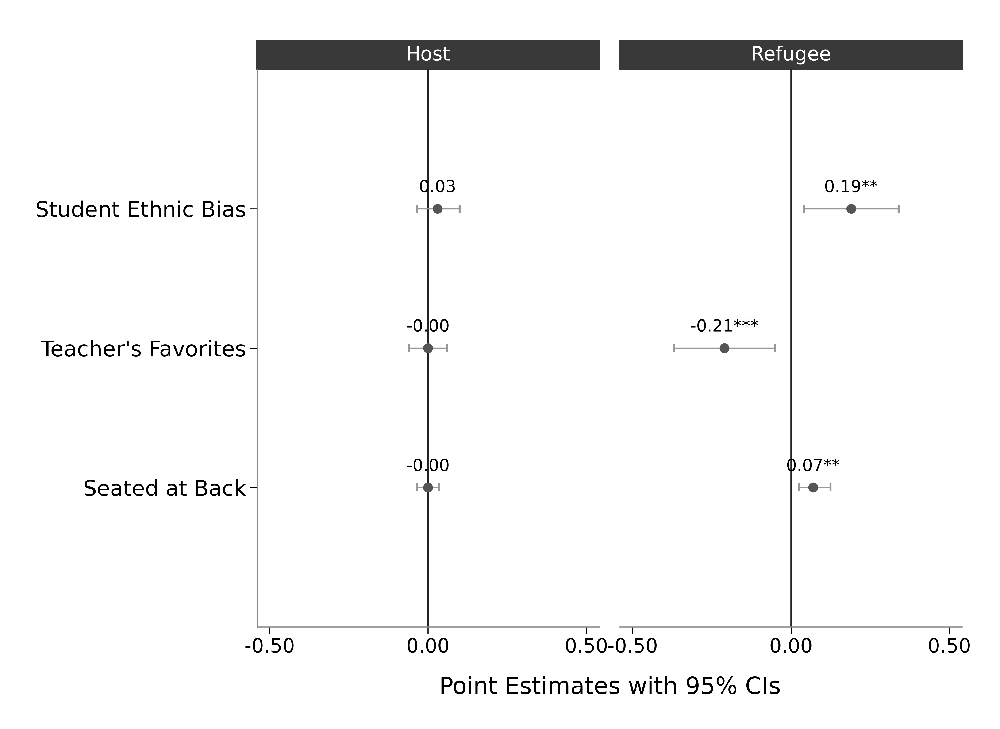

- **Subtype:** `host-refugee-point-estimates-with-95ci`
- **Use when:** Compare treatment effects across host and refugee groups; Test sign and precision against zero
- **Required fields:** `display, estimate, high, label, low, order, panel`
- **Data meaning:** point position encodes the estimate and whiskers encode supplied lower and upper limits
- **Tags:** `black-zero-line, effect-x, gray-interval, gray-point, one-by-two, outcome-y, panel-strips, point-interval, two-panels`
- **Code:** [`host-refugee-coefficients-2panel.py`](figures/coefficient-plot/host-refugee-coefficients-2panel.py)

> Specialized constraint: Estimate and every displayed interval boundary must be supplied on identical keys.

### lecture-days-forest-by-domain

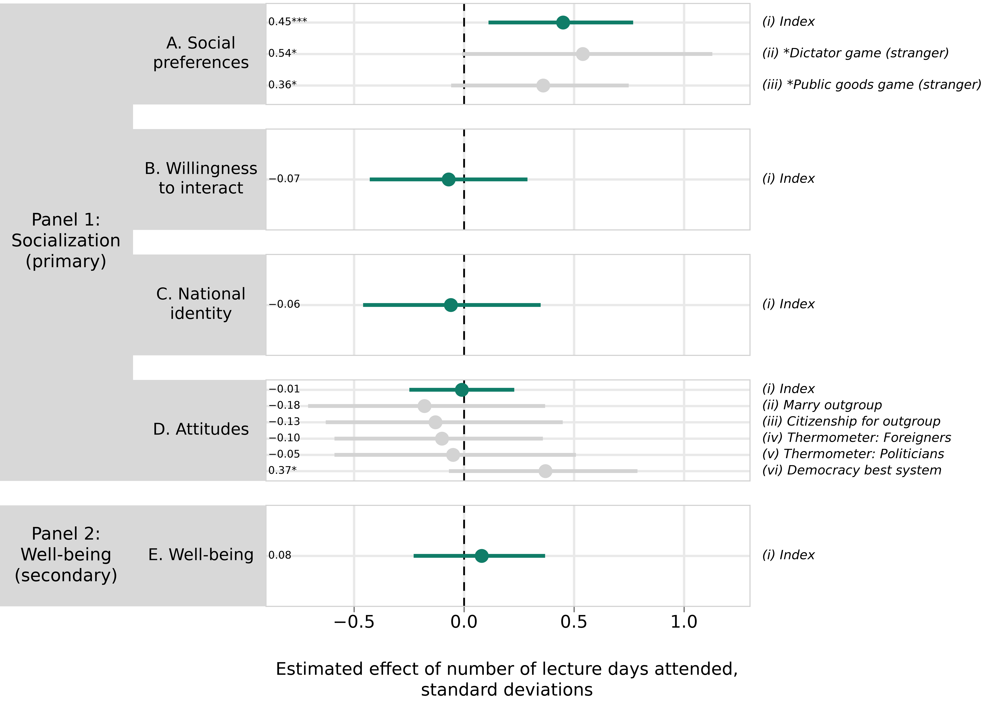

- **Subtype:** `domain-grouped-lecture-day-estimates`
- **Use when:** Compare estimated lecture-day effects across outcome domains; Separate primary from secondary outcome blocks
- **Required fields:** `color, display, estimate, high, label, low, panel, section, y`
- **Data meaning:** point position encodes the estimate and whiskers encode supplied lower and upper limits
- **Tags:** `confidence-interval, effect-x, forest-plot, gray-secondary, green-index, grouped-rows, left-estimate-values, portrait, right-outcome-labels, zero-reference`
- **Code:** [`lecture-days-forest-by-domain.py`](figures/coefficient-plot/lecture-days-forest-by-domain.py)

> Specialized constraint: Estimate and every displayed interval boundary must be supplied on identical keys.

### mental-health-study-comparison

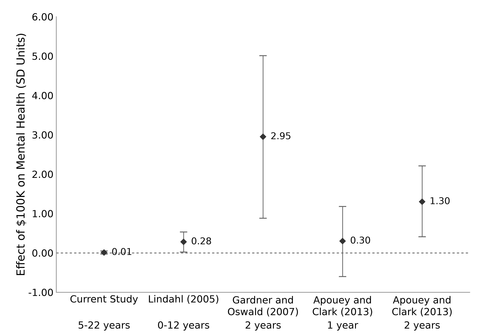

- **Subtype:** `study-point-intervals`
- **Use when:** Compare study-level mental-health effect summaries and exposure durations.
- **Required fields:** `duration, estimate, high, label, low, order`
- **Data meaning:** point position encodes the estimate and whiskers encode supplied lower and upper limits
- **Tags:** `black-marker, diamond-marker, gray-interval, two-level-study-label, value-label, vertical-point-interval`
- **Code:** [`mental-health-study-comparison.py`](figures/coefficient-plot/mental-health-study-comparison.py)

> Specialized constraint: Estimate and every displayed interval boundary must be supplied on identical keys.

### quartile-effect-coefficients-2x2

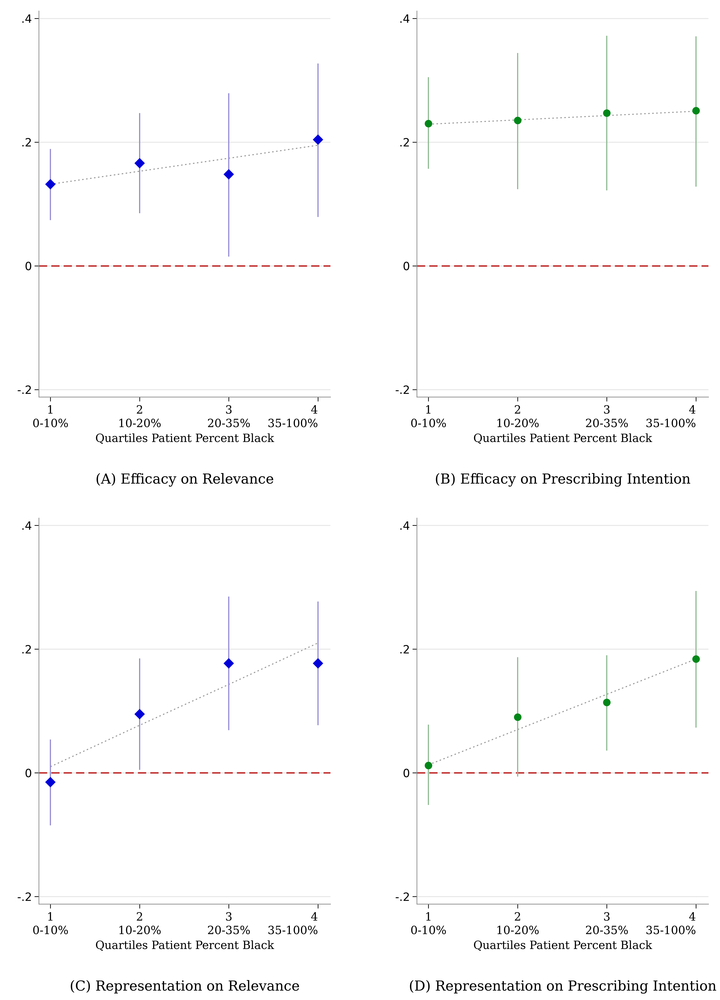

- **Subtype:** `quartile-effect-four-panel-comparison`
- **Use when:** Compare heterogeneous effects across ordered quartiles; Contrast efficacy and representation outcomes
- **Required fields:** `color, estimate, fit, high, low, panel, quartile, title`
- **Data meaning:** point position encodes the estimate and whiskers encode supplied lower and upper limits
- **Tags:** `blue-diamond, effect-y, four-panels, green-circle, panel-caption, point-interval, quartile-x, red-zero-line, supplied-reference-path, two-by-two`
- **Code:** [`quartile-effect-coefficients-2x2.py`](figures/coefficient-plot/quartile-effect-coefficients-2x2.py)

> Specialized constraint: Estimate and every displayed interval boundary must be supplied on identical keys.

### replication-alpha-coefficients-2x2

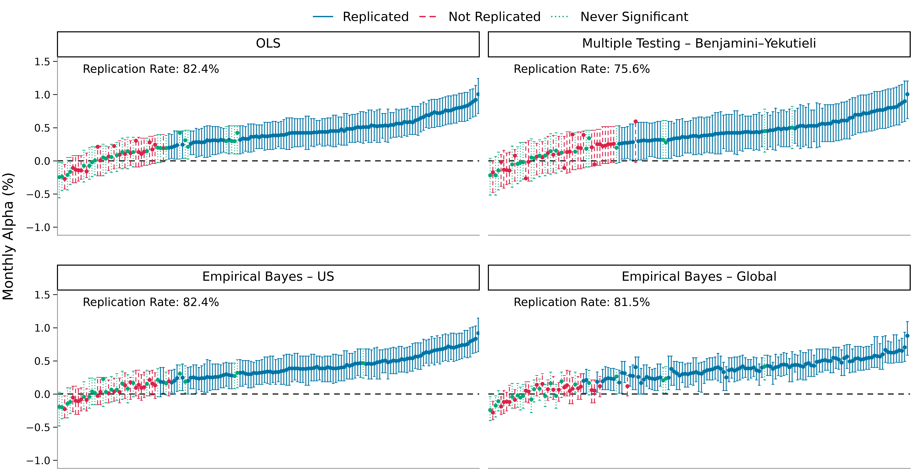

- **Subtype:** `replication-status-alpha-estimates`
- **Use when:** Compare alpha distributions across replication procedures; Inspect uncertainty and status by ordered estimate
- **Required fields:** `estimate, high, low, panel, rank, rate, status, title`
- **Data meaning:** point position encodes the estimate and whiskers encode supplied lower and upper limits
- **Tags:** `alpha-y, blue-replicated, dense-point-interval, four-panels, global-legend, green-never-significant, rank-x, red-not-replicated, replication-rate, two-by-two, zero-reference`
- **Code:** [`replication-alpha-coefficients-2x2.py`](figures/coefficient-plot/replication-alpha-coefficients-2x2.py)

> Specialized constraint: Estimate and every displayed interval boundary must be supplied on identical keys.

### treatment-arm-domain-intervals

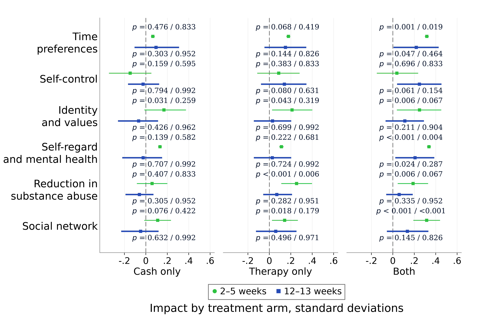

- **Subtype:** `three-facet-paired-intervals`
- **Use when:** Compare short- and later-term domain effects across three treatment arms.
- **Required fields:** `display, estimate, high, label, low, order, panel, series`
- **Data meaning:** point position encodes the estimate and whiskers encode supplied lower and upper limits
- **Tags:** `blue-later-term, green-short-term, literal-p-labels, paired-horizontal-interval, shared-domain-rows, three-facets`
- **Code:** [`treatment-arm-domain-intervals.py`](figures/coefficient-plot/treatment-arm-domain-intervals.py)

> Specialized constraint: Estimate and every displayed interval boundary must be supplied on identical keys.

### values-financial-promotion-forest

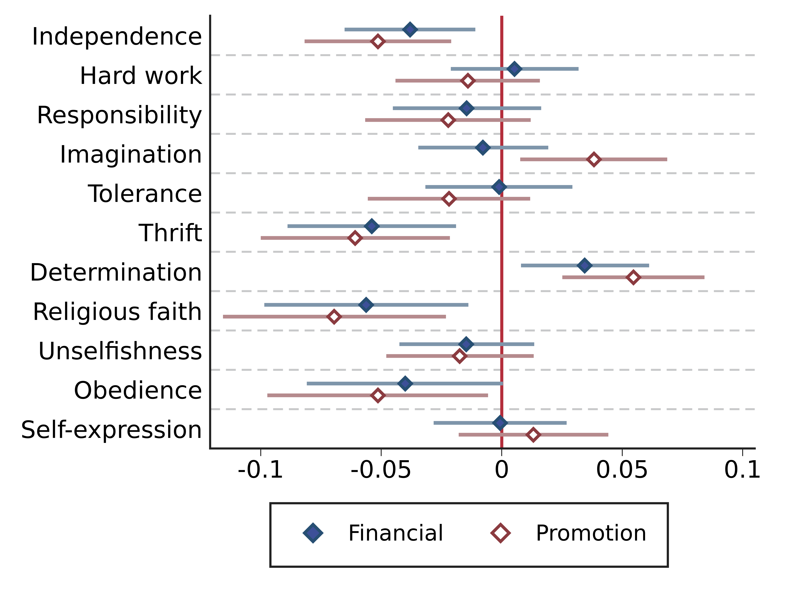

- **Subtype:** `paired-horizontal-intervals`
- **Use when:** Compare two supplied effects across value domains.
- **Required fields:** `estimate, high, label, low, order, series`
- **Data meaning:** point position encodes the estimate and whiskers encode supplied lower and upper limits
- **Tags:** `blue-financial, filled-hollow-markers, horizontal-interval, paired-diamonds, red-promotion, red-zero-reference, row-separators`
- **Code:** [`values-financial-promotion-forest.py`](figures/coefficient-plot/values-financial-promotion-forest.py)

> Specialized constraint: Estimate and every displayed interval boundary must be supplied on identical keys.

## distribution

### crop-output-density-2x2

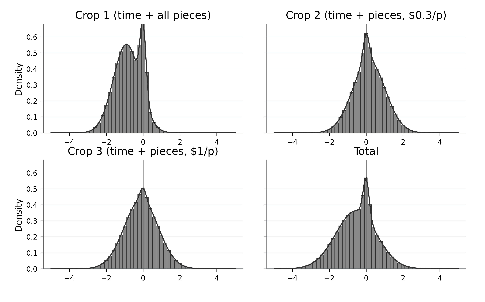

- **Subtype:** `four-outcome-density-panels`
- **Use when:** Compare transformed outcome distributions across crop definitions; Inspect mass around a zero reference
- **Required fields:** `density, panel, x`
- **Data meaning:** position and density, frequency, or probability encode distribution shape
- **Tags:** `compact-landscape, dark-outline, density-outline, gray-fill, histogram-bars, panel-titles, shared-density-y, symmetric-x, two-by-two, two-by-two-panels, zero-reference`
- **Code:** [`crop-output-density-2x2.py`](figures/distribution/crop-output-density-2x2.py)

### sales-density-baseline-endline-2panel

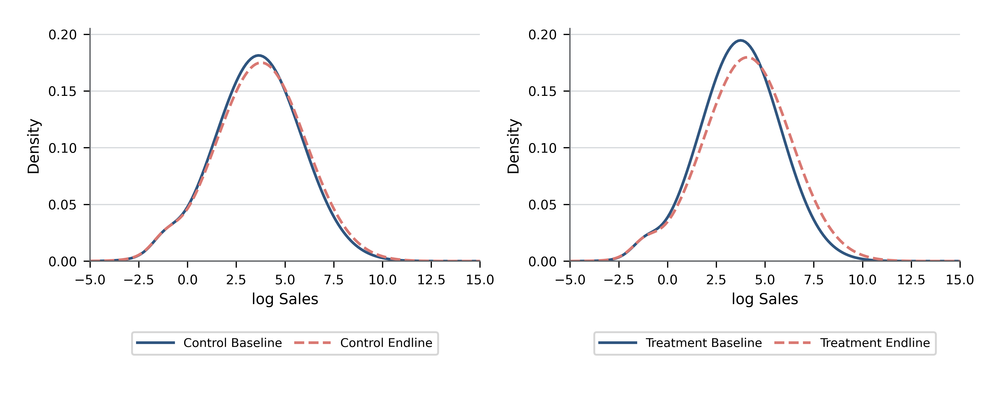

- **Subtype:** `control-treatment-baseline-endline`
- **Use when:** Compare distribution shifts within treatment arms; Separate time change from treatment-control differences
- **Required fields:** `density, line, panel, series, x`
- **Data meaning:** position and density, frequency, or probability encode distribution shape
- **Tags:** `blue-solid, density-line, density-y, log-sales-x, low-wide, one-by-two, panel-specific-bottom-legends, red-dashed, redundant-line-style, shared-domain, two-series-per-panel`
- **Code:** [`sales-density-baseline-endline-2panel.py`](figures/distribution/sales-density-baseline-endline-2panel.py)

### state-income-expenditure-regressions-2panel

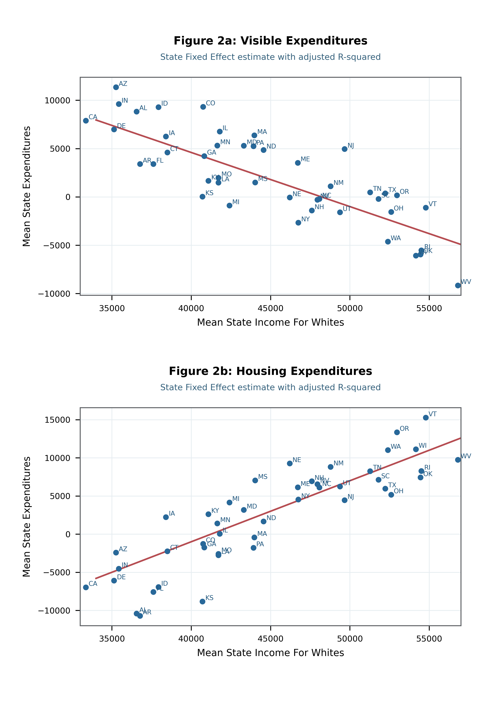

- **Subtype:** `state-level-fixed-effect-regressions`
- **Use when:** Compare state-level visible and housing expenditure relationships; Preserve state identities around fitted trends
- **Required fields:** `expenditure, income, kind, panel, state`
- **Data meaning:** position and density, frequency, or probability encode distribution shape
- **Tags:** `blue-points, expenditure-y, figure-titles, income-x, model-note, panel-specific-y, portrait, red-fit, scatter, state-labels, supplied-linear-fit, two-panel, two-rows`
- **Code:** [`state-income-expenditure-regressions-2panel.py`](figures/distribution/state-income-expenditure-regressions-2panel.py)

### treatment-issue-density-4series

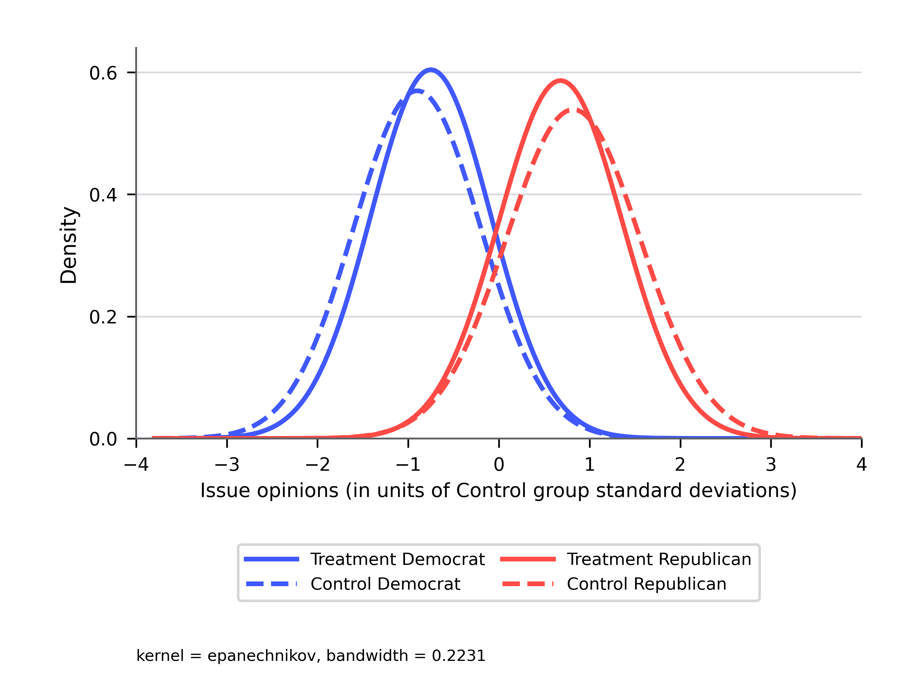

- **Subtype:** `treatment-control-party-comparison`
- **Use when:** Compare issue-position distributions by party and treatment; Show within-party shifts using redundant encoding
- **Required fields:** `color, density, line, series, x`
- **Data meaning:** position and density, frequency, or probability encode distribution shape
- **Tags:** `bandwidth-note, compact, density-line, density-y, double-encoding, four-series, party-color, single-panel, standardized-opinion-x, treatment-line-style, two-row-bottom-legend`
- **Code:** [`treatment-issue-density-4series.py`](figures/distribution/treatment-issue-density-4series.py)

## event-study

### delay-state-event-shaded-windows

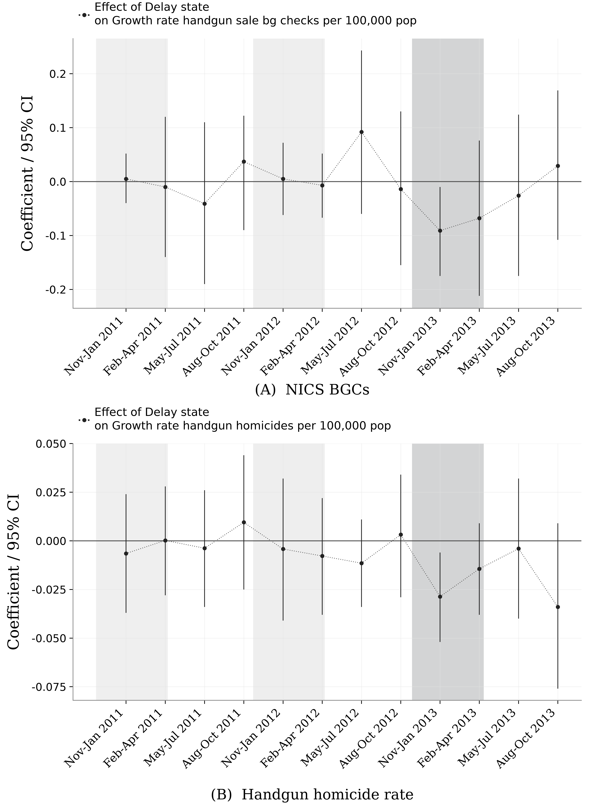

- **Subtype:** `event-intervals-with-time-windows`
- **Use when:** Compare time-specific effects with highlighted calendar windows.
- **Required fields:** `estimate, high, low, panel, x`
- **Data meaning:** event time encodes distance from the event; estimates and interval bounds are supplied, not calculated
- **Tags:** `background-time-windows, black-estimates, dotted-connected-estimates, gray-window-fills, rotated-date-labels, vertical-interval`
- **Code:** [`delay-state-event-shaded-windows.py`](figures/event-study/delay-state-event-shaded-windows.py)

> Specialized constraint: Estimate and every displayed interval boundary must be supplied on identical keys.

### event-response-2x2-dashed-bounds

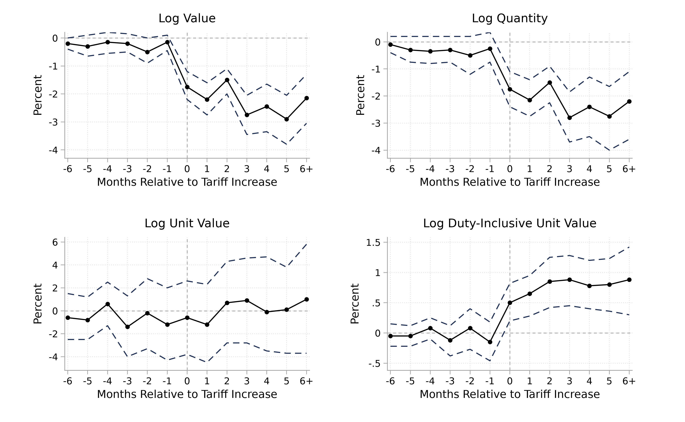

- **Subtype:** `four-panel-dynamic-response`
- **Use when:** Compare dynamic responses across four related outcome measures; Show point estimates and supplied interval bounds around an event date
- **Required fields:** `estimate, lower, panel, panel_order, period, period_label, title, upper, y_max, y_min, y_tick_interval`
- **Data meaning:** event time encodes distance from the event; estimates and interval bounds are supplied, not calculated
- **Tags:** `aligned-columns, aligned-rows, circle-marker, compact-small-multiples, continuous-period-x, dashed-navy-bounds, dotted-grid, event-line, four-panel, left-bottom-spines, line, no-legend, panel-specific-y, panel-title, point-estimate, shared-event-time, solid-black, two-by-two, zero-line`
- **Code:** [`event-response-2x2-dashed-bounds.py`](figures/event-study/event-response-2x2-dashed-bounds.py)

> Specialized constraint: Estimate and every displayed interval boundary must be supplied on identical keys.

### evolution-reform-two-estimators

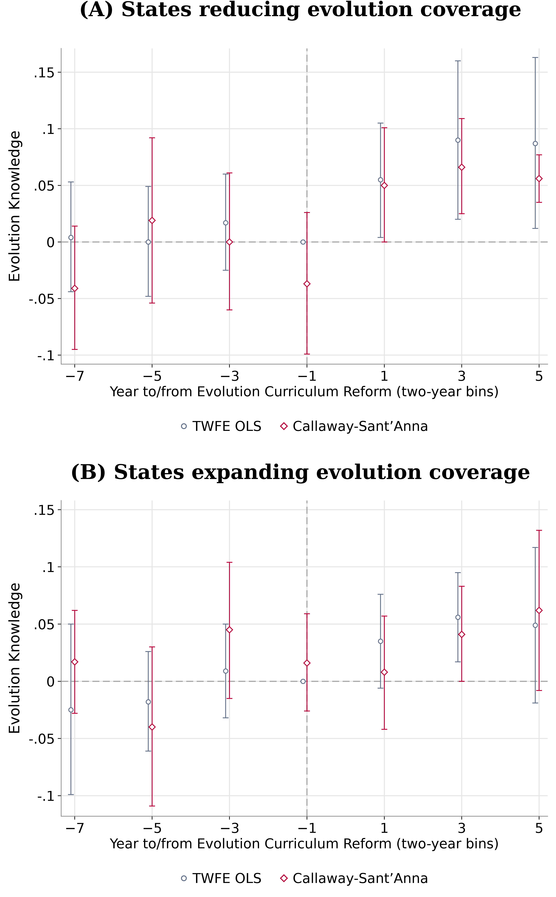

- **Subtype:** `two-estimator-event-study`
- **Use when:** Compare two supplied estimators around curriculum changes in two-year bins.
- **Required fields:** `estimate, high, low, panel, series, x`
- **Data meaning:** event time encodes distance from the event; estimates and interval bounds are supplied, not calculated
- **Tags:** `gray-blue-estimator, open-circle, open-diamond, red-estimator, two-estimator-point-interval, two-vertical-panels`
- **Code:** [`evolution-reform-two-estimators.py`](figures/event-study/evolution-reform-two-estimators.py)

> Specialized constraint: Estimate and every displayed interval boundary must be supplied on identical keys.

### expansion-eligibility-event-2panel

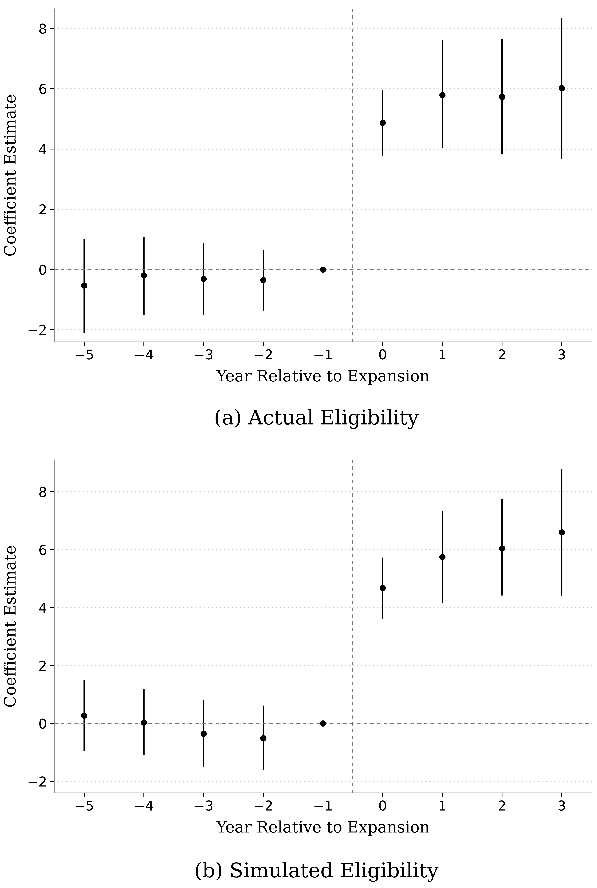

- **Subtype:** `two-panel-event-study`
- **Use when:** Compare actual and simulated eligibility effects around expansion.
- **Required fields:** `estimate, high, low, panel, x`
- **Data meaning:** event time encodes distance from the event; estimates and interval bounds are supplied, not calculated
- **Tags:** `between-period-event-divider, black-interval, black-point, event-point-interval, reference-period, two-vertical-panels`
- **Code:** [`expansion-eligibility-event-2panel.py`](figures/event-study/expansion-eligibility-event-2panel.py)

> Specialized constraint: Estimate and every displayed interval boundary must be supplied on identical keys.

### receipt-week-overlapping-bands

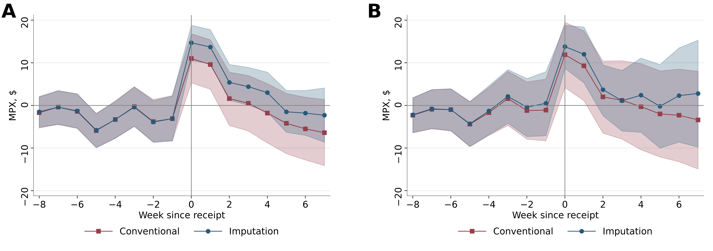

- **Subtype:** `two-panel-overlapping-interval-bands`
- **Use when:** Compare conventional and imputation paths with overlapping uncertainty bands.
- **Required fields:** `estimate, high, low, panel, series, x`
- **Data meaning:** event time encodes distance from the event; estimates and interval bounds are supplied, not calculated
- **Tags:** `blue-imputation, circle-line, overlapping-ribbons, red-conventional, square-line, two-panels`
- **Code:** [`receipt-week-overlapping-bands.py`](figures/event-study/receipt-week-overlapping-bands.py)

> Specialized constraint: Estimate and every displayed interval boundary must be supplied on identical keys.

### release-mortality-five-paths-6panel

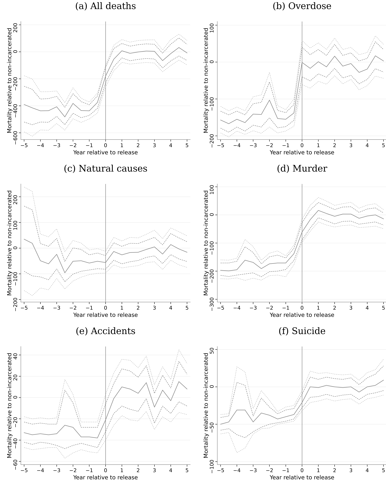

- **Subtype:** `six-panel-independent-boundaries`
- **Use when:** Compare mortality response paths and two supplied boundary pairs across outcomes.
- **Required fields:** `estimate, high, low, outer_high, outer_low, panel, x`
- **Data meaning:** event time encodes distance from the event; estimates and interval bounds are supplied, not calculated
- **Tags:** `center-path, gray-line, inner-dashed-boundaries, outer-dashed-boundaries, six-facets, two-dash-weights`
- **Code:** [`release-mortality-five-paths-6panel.py`](figures/event-study/release-mortality-five-paths-6panel.py)

> Specialized constraint: Estimate and every displayed interval boundary must be supplied on identical keys.

### transformation-trends-effects-2x3

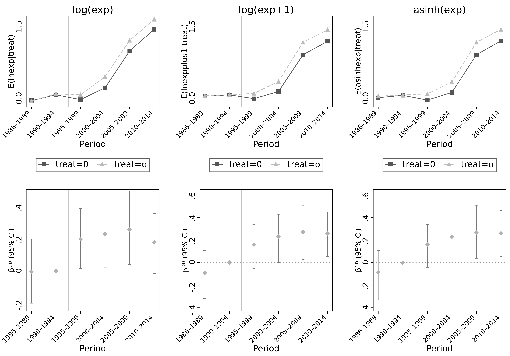

- **Subtype:** `three-transforms-trends-and-effects`
- **Use when:** Compare supplied transformed trends and difference-in-differences summaries.
- **Required fields:** `control, estimate, high, low, panel, treated, x`
- **Data meaning:** event time encodes distance from the event; estimates and interval bounds are supplied, not calculated
- **Tags:** `coefficient-interval, gray-effect-diamonds, paired-trends, repeated-legends, square-solid-control, triangle-dashed-treated, two-by-three-panels`
- **Code:** [`transformation-trends-effects-2x3.py`](figures/event-study/transformation-trends-effects-2x3.py)

> Specialized constraint: Estimate and every displayed interval boundary must be supplied on identical keys.

## grouped-bar

### grouped-hbar-2series-filled-outline

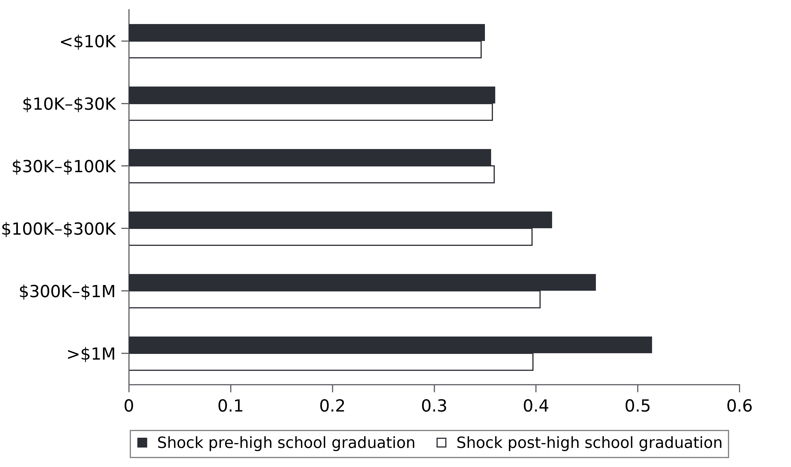

- **Subtype:** `grouped-horizontal-bar`
- **Use when:** Compare two related conditions across ordered categories with long labels; Preserve rapid within-category comparison in grayscale printing
- **Required fields:** `category, category_order, series, value`
- **Data meaning:** adjacent bars encode series values within a shared category
- **Tags:** `compact-pair, equal-height, grayscale-safe, grouped, horizontal-bar, legend-bottom, legend-outside-plot, long-label-margin, no-data-label, no-grid, ordered-category-y, outward-ticks, redundant-fill-state, single-panel, solid-vs-outline, two-series, zero-baseline`
- **Code:** [`grouped-hbar-2series-filled-outline.py`](figures/grouped-bar/grouped-hbar-2series-filled-outline.py)

### grouped-hbar-3series-3gray

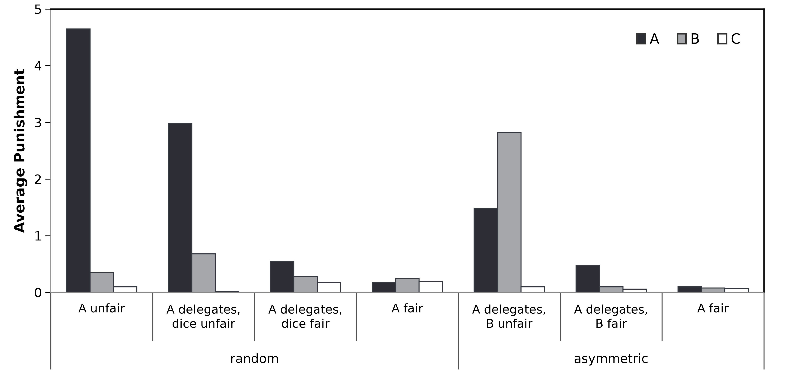

- **Subtype:** `seven-category-three-series-grayscale-comparison`
- **Use when:** Compare three outcomes across treatment conditions; Separate two experimental regimes
- **Required fields:** `category, order, section, series, value`
- **Data meaning:** adjacent bars encode series values within a shared category
- **Tags:** `categorical-x, dark-gray, mid-gray, section-divider, section-labels, single-panel, top-right-legend, vertical-grouped-bars, white-outline, zero-baseline`
- **Code:** [`grouped-hbar-3series-3gray.py`](figures/grouped-bar/grouped-hbar-3series-3gray.py)

### grouped-vbar-2series-year

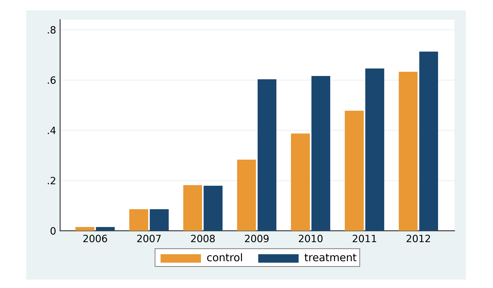

- **Subtype:** `grouped-vertical-bar`
- **Use when:** Compare treatment and control groups across ordered periods; Show the evolution of two series over time
- **Required fields:** `period, series, value`
- **Data meaning:** adjacent bars encode series values within a shared category
- **Tags:** `categorical-color, equal-width, fixed-y-range, grouped, horizontal-grid, legend-bottom, no-data-label, orange-vs-navy, ordered-time-x, side-by-side, single-panel, two-series, vertical-bar, white-plot-on-tinted-frame, zero-baseline`
- **Code:** [`grouped-vbar-2series-year.py`](figures/grouped-bar/grouped-vbar-2series-year.py)

### grouped-vbar-4series-country

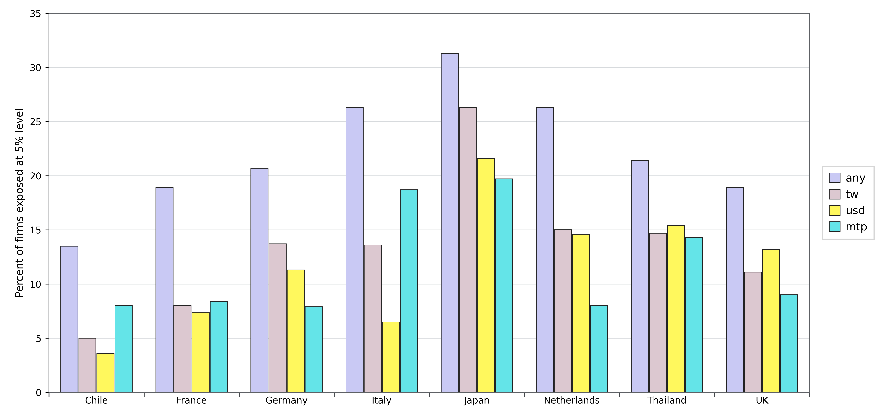

- **Subtype:** `four-series-country-comparison`
- **Use when:** Compare four exposure definitions across countries; Identify cross-country differences in detection rates
- **Required fields:** `country, country_order, series, series_order, value`
- **Data meaning:** adjacent bars encode series values within a shared category
- **Tags:** `dark-outlines, eight-categories, external-legend-margin, four-pastel-colors, four-series, grouped, horizontal-grid, legend-outside-right, percent-y, vertical-bar, wide-landscape, zero-baseline`
- **Code:** [`grouped-vbar-4series-country.py`](figures/grouped-bar/grouped-vbar-4series-country.py)

### grouped-vbar-benchmark-2x2

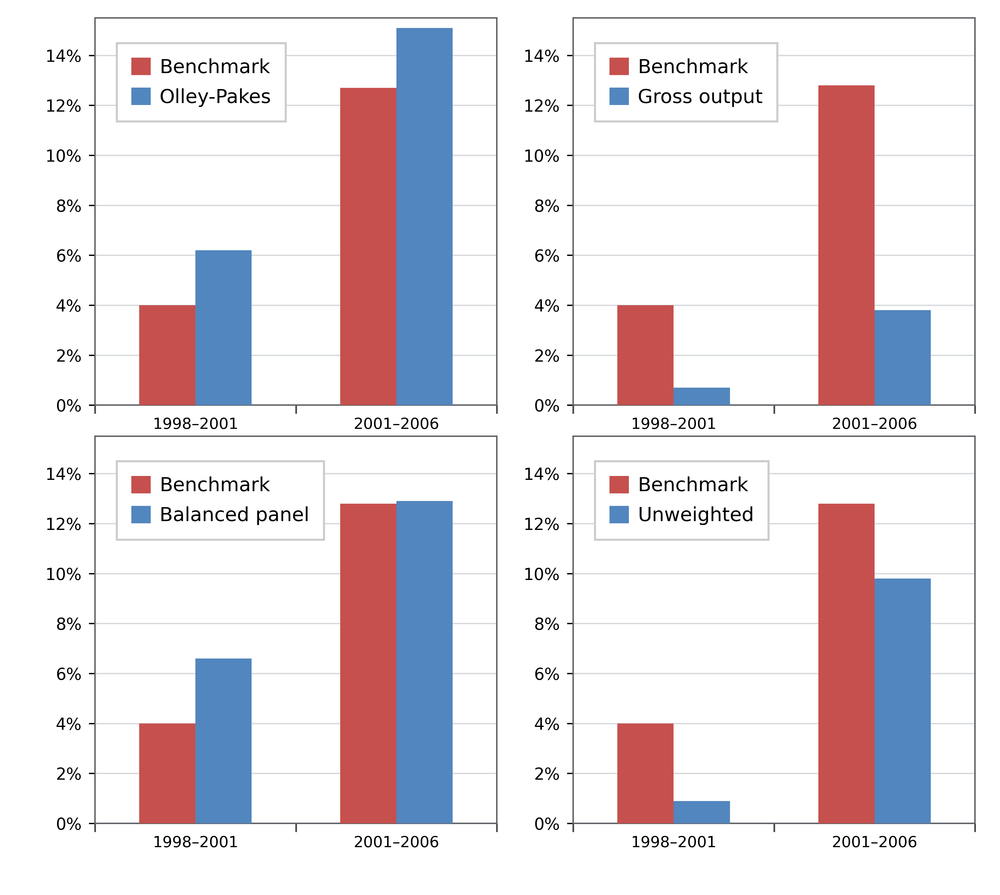

- **Subtype:** `four-panel-benchmark-versus-alternative`
- **Use when:** Compare robustness alternatives against one benchmark; Show how two period estimates change across four specifications
- **Required fields:** `panel, panel_order, period, period_order, series, series_order, value`
- **Data meaning:** adjacent bars encode series values within a shared category
- **Tags:** `blue-alternative, four-panel, grouped, horizontal-grid, measured-center-gutter, panel-specific-legends, percent-y, red-benchmark, shared-y-range, two-by-two, two-series, vertical-bar, zero-baseline`
- **Code:** [`grouped-vbar-benchmark-2x2.py`](figures/grouped-bar/grouped-vbar-benchmark-2x2.py)

## heatmap

### age-year-grayscale-heatmaps-4panel

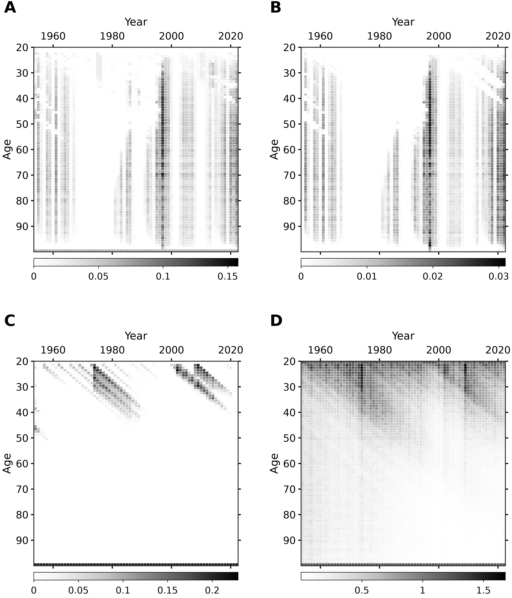

- **Subtype:** `age-year-grayscale-heatmaps-4panel`
- **Use when:** Compare age-by-year surfaces across four components.
- **Required fields:** `age, blue, column, green, panel, red, row, year`
- **Data meaning:** cell color encodes magnitude at the row-column intersection
- **Tags:** `four-panel-grayscale-heatmap, horizontal-colorbars, reversed-age-axis, top-year-axis, white-cell-gaps`
- **Code:** [`age-year-grayscale-heatmaps-4panel.py`](figures/heatmap/age-year-grayscale-heatmaps-4panel.py)

> Specialized constraint: Do not reorder rows or columns unless the ordering rule is supplied or explicitly approved.

### exposure-sales-diverging-heatmap

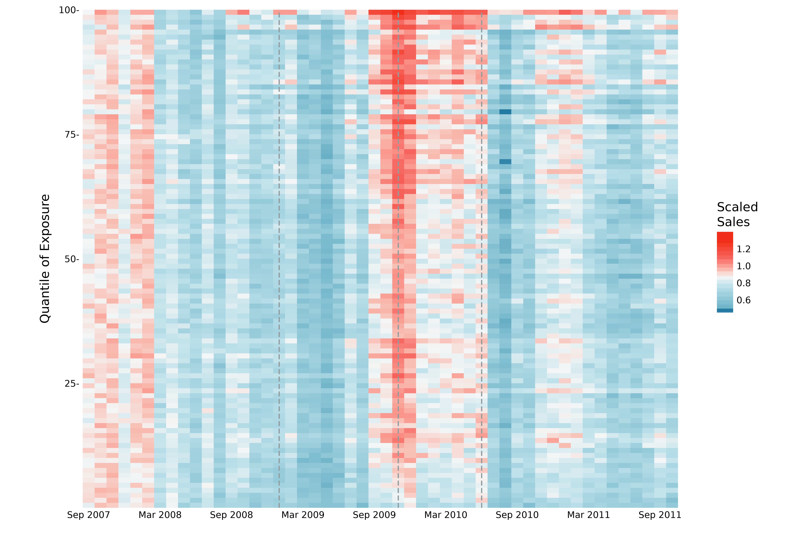

- **Subtype:** `exposure-sales-diverging-heatmap`
- **Use when:** Compare exposure quantiles over monthly time with a diverging sales color scale.
- **Required fields:** `blue, column, date, green, index, red, row`
- **Data meaning:** cell color encodes magnitude at the row-column intersection
- **Tags:** `dashed-time-references, diverging-heatmap, month-columns, quantile-rows, vertical-color-key`
- **Code:** [`exposure-sales-diverging-heatmap.py`](figures/heatmap/exposure-sales-diverging-heatmap.py)

> Specialized constraint: Do not reorder rows or columns unless the ordering rule is supplied or explicitly approved.

### factor-selection-heatmaps-8panel

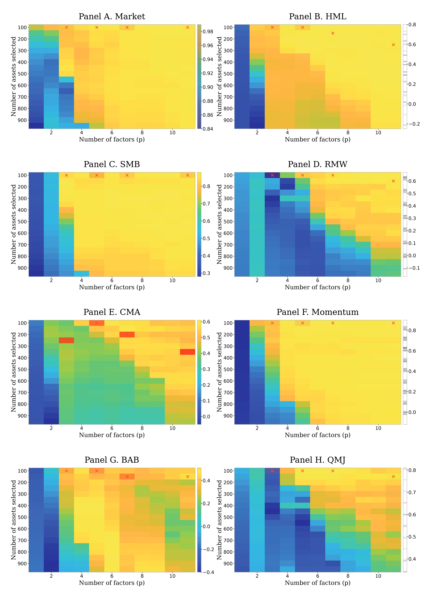

- **Subtype:** `factor-selection-heatmaps-8panel`
- **Use when:** Compare asset-selection grids across eight factor families.
- **Required fields:** `assets, blue, column, factors, green, index, panel, red, row`
- **Data meaning:** cell color encodes magnitude at the row-column intersection
- **Tags:** `eight-panel-heatmap, panel-specific-color-scale, red-selection-crosses`
- **Code:** [`factor-selection-heatmaps-8panel.py`](figures/heatmap/factor-selection-heatmaps-8panel.py)

> Specialized constraint: Do not reorder rows or columns unless the ordering rule is supplied or explicitly approved.

### state-week-grayscale-heatmap

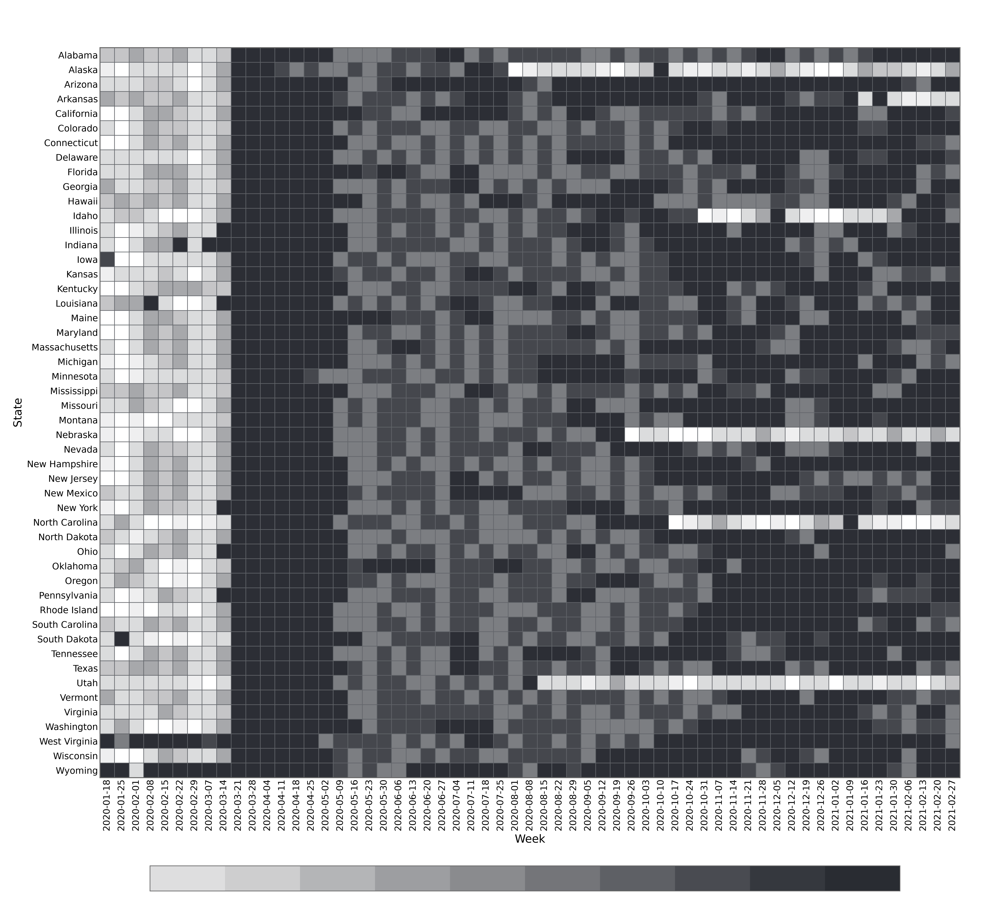

- **Subtype:** `state-by-week-grayscale-matrix`
- **Use when:** Display a state-by-week matrix using a caller-declared color mapping.
- **Required fields:** `blue, column, date, green, red, row, state`
- **Data meaning:** cell color encodes magnitude at the row-column intersection
- **Tags:** `grayscale-key, rectangular-heatmap, state-rows, supplied-cell-colors, weekly-columns`
- **Code:** [`state-week-grayscale-heatmap.py`](figures/heatmap/state-week-grayscale-heatmap.py)

> Specialized constraint: Do not reorder rows or columns unless the ordering rule is supplied or explicitly approved.

## interval-band

### interval-response-4x2-multigroup

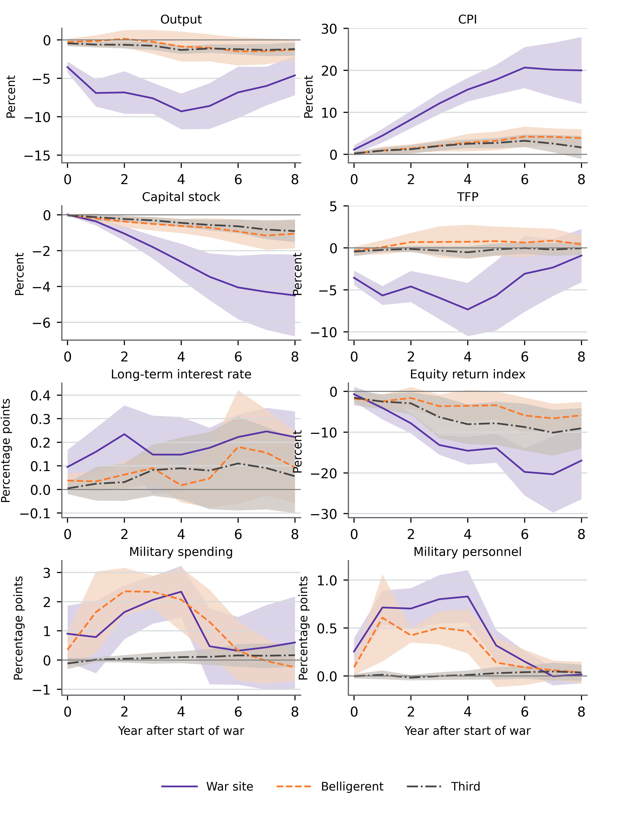

- **Subtype:** `eight-panel-three-group-response`
- **Use when:** Compare dynamic responses across eight outcome measures; Compare three groups with panel-specific units and scales
- **Required fields:** `estimate, group, group_order, horizon, lower, panel, upper`
- **Data meaning:** the center line or mark encodes the estimate; boundaries encode separately supplied uncertainty limits
- **Tags:** `compact-small-multiples, eight-panel, four-by-two, gray-dash-dot, horizon-x, horizontal-grid, interval-band, line, orange-dashed, panel-specific-y, purple-solid, shared-bottom-legend, zero-lines`
- **Code:** [`interval-response-4x2-multigroup.py`](figures/interval-band/interval-response-4x2-multigroup.py)

> Specialized constraint: Estimate and every displayed interval boundary must be supplied on identical keys.

### irf-shaded-ci-2x3

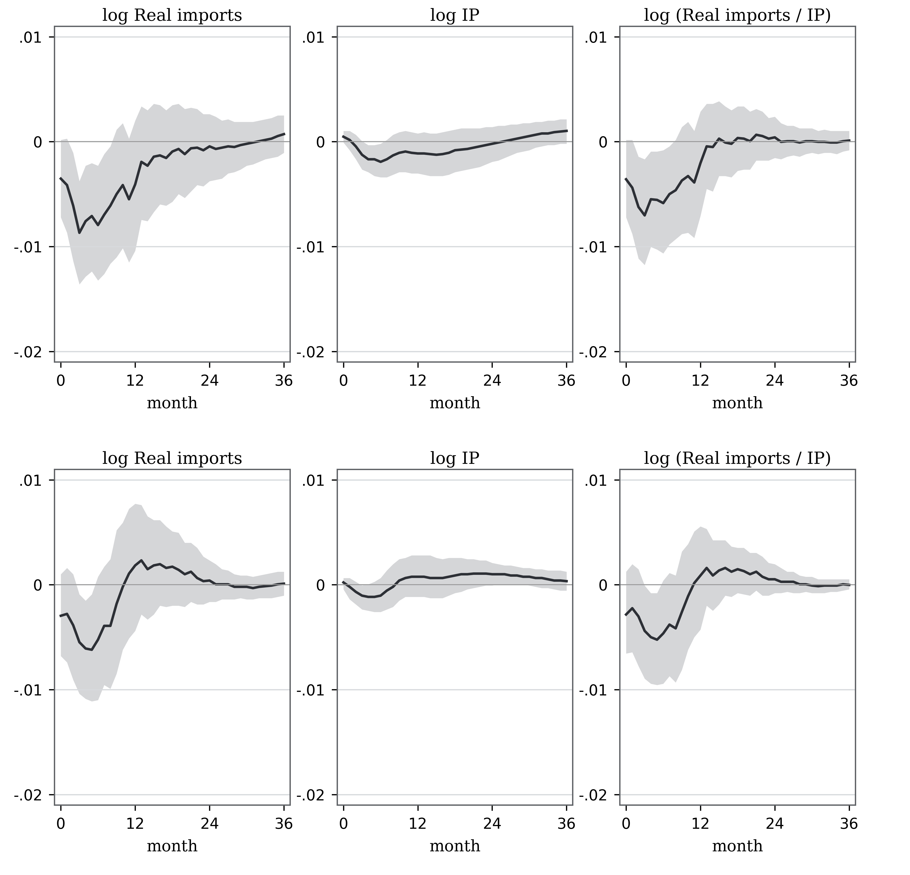

- **Subtype:** `six-panel-impulse-response`
- **Use when:** Compare impulse responses across three measures and two specifications; Show uncertainty decay over a common horizon
- **Required fields:** `estimate, lower, month, panel, panel_order, upper`
- **Data meaning:** the center line or mark encodes the estimate; boundaries encode separately supplied uncertainty limits
- **Tags:** `dark-solid-response, full-spines, gray-shaded-interval, interval-band, line, month-horizon-x, panel-titles, shared-y-range, six-panel, two-by-three, two-by-three-small-multiples, zero-lines`
- **Code:** [`irf-shaded-ci-2x3.py`](figures/interval-band/irf-shaded-ci-2x3.py)

> Specialized constraint: Estimate and every displayed interval boundary must be supplied on identical keys.

### pdf-cdf-parametric-bounds-2panel

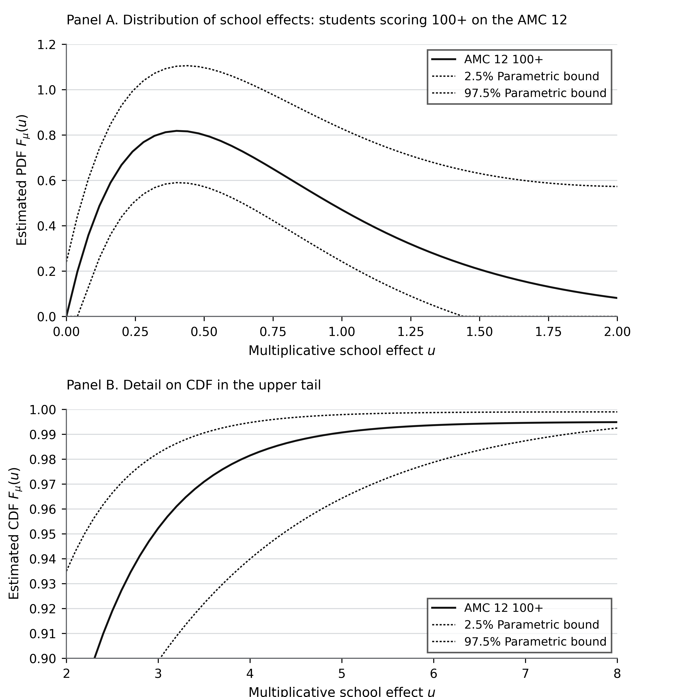

- **Subtype:** `two-panel-distribution-envelope`
- **Use when:** Show an estimated distribution with parametric bounds; Inspect upper-tail CDF behavior at an expanded scale
- **Required fields:** `panel, series, series_order, value, x`
- **Data meaning:** the center line or mark encodes the estimate; boundaries encode separately supplied uncertainty limits
- **Tags:** `dotted-bounds, envelope-bounds, grayscale-safe, horizontal-grid, line, panel-specific-x, panel-specific-y, panel-titles, separate-legends, solid-center, stacked-distribution-panels, two-panel, vertical-stack`
- **Code:** [`pdf-cdf-parametric-bounds-2panel.py`](figures/interval-band/pdf-cdf-parametric-bounds-2panel.py)

> Specialized constraint: Estimate and every displayed interval boundary must be supplied on identical keys.

### quantile-effect-two-layer-ci

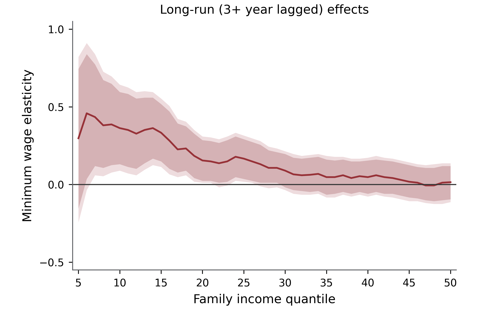

- **Subtype:** `single-line-nested-confidence-bands`
- **Use when:** Show heterogeneous effects across quantiles; Distinguish inner and outer uncertainty ranges around one estimate line
- **Required fields:** `estimate, inner_lower, inner_upper, outer_lower, outer_upper, quantile`
- **Data meaning:** the center line or mark encodes the estimate; boundaries encode separately supplied uncertainty limits
- **Tags:** `centered-title, compact-landscape, dark-red-line, effect-y, line, medium-red-inner-band, nested-interval-band, no-grid, pale-red-outer-band, quantile-x, single-panel, zero-line`
- **Code:** [`quantile-effect-two-layer-ci.py`](figures/interval-band/quantile-effect-two-layer-ci.py)

> Specialized constraint: Estimate and every displayed interval boundary must be supplied on identical keys.

## line-trend

### annotated-dual-axis-trends-2panel

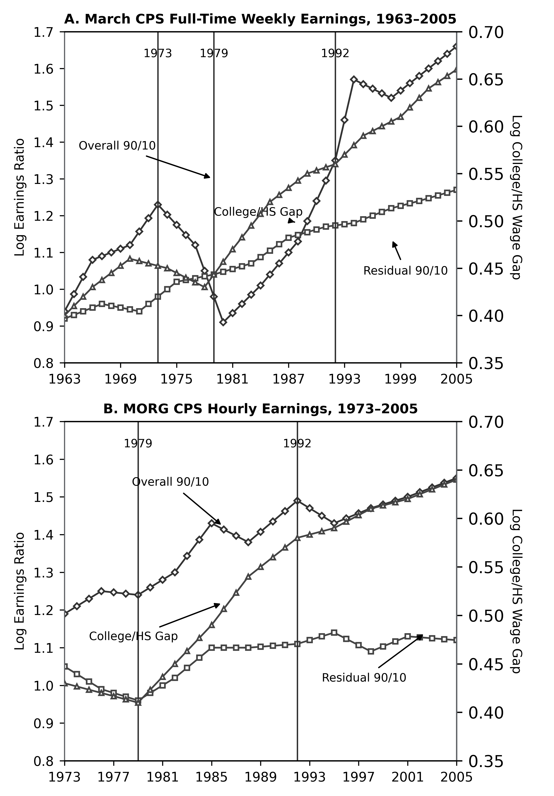

- **Subtype:** `two-panel-annotated-dual-axis-trends`
- **Use when:** Compare distributional and wage-gap trends across two samples; Mark structural years and directly identify three series
- **Required fields:** `axis, panel, series, series_order, value, year`
- **Data meaning:** position on the horizontal axis encodes order; line position encodes the supplied value
- **Tags:** `aligned-vertical-panels, arrow-labels, bold-panel-titles, continuous-year-x, dual-axis, full-spines, grayscale-safe, independent-y-scales, line, open-diamond, open-square, open-triangle, two-panel, vertical-stack, vertical-year-lines`
- **Code:** [`annotated-dual-axis-trends-2panel.py`](figures/line-trend/annotated-dual-axis-trends-2panel.py)

> Specialized constraint: Require explicit units and a written reason for using independent axes; never imply comparability from aligned slopes.

### dual-axis-diverging-trends

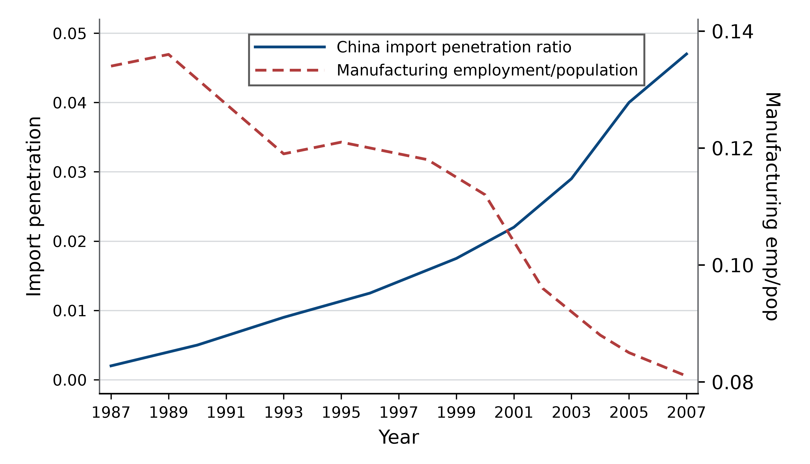

- **Subtype:** `dual-axis-opposing-annual-trends`
- **Use when:** Compare two annual indicators with different units and opposing trends; Show structural divergence over time
- **Required fields:** `import_penetration, manufacturing_emp_population, year`
- **Data meaning:** position on the horizontal axis encodes order; line position encodes the supplied value
- **Tags:** `continuous-year-x, dual-axis, grayscale-redundant, horizontal-grid, independent-y-scales, legend-inside-top, line, navy-solid, red-dashed, single-panel, wide-landscape`
- **Code:** [`dual-axis-diverging-trends.py`](figures/line-trend/dual-axis-diverging-trends.py)

> Specialized constraint: Require explicit units and a written reason for using independent axes; never imply comparability from aligned slopes.

### dual-axis-employment-value-added

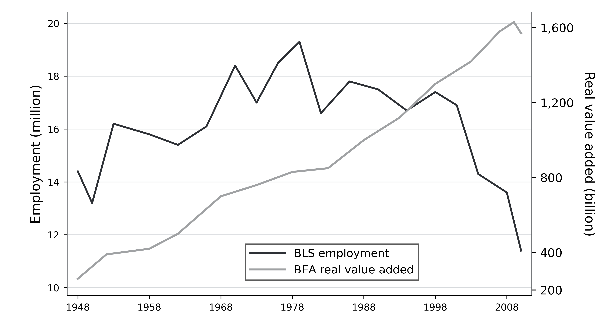

- **Subtype:** `long-horizon-dual-axis-level-trends`
- **Use when:** Compare employment and output levels over a long period; Show divergence and reversal across indicators with different units
- **Required fields:** `employment_million, real_value_added_billion, year`
- **Data meaning:** position on the horizontal axis encodes order; line position encodes the supplied value
- **Tags:** `continuous-year-x, dark-solid, dual-axis, grayscale-luminance, horizontal-grid, independent-y-scales, legend-inside-bottom, light-solid, line, long-horizon, single-panel, wide-landscape`
- **Code:** [`dual-axis-employment-value-added.py`](figures/line-trend/dual-axis-employment-value-added.py)

> Specialized constraint: Require explicit units and a written reason for using independent axes; never imply comparability from aligned slopes.

### dual-axis-three-ratio-trends

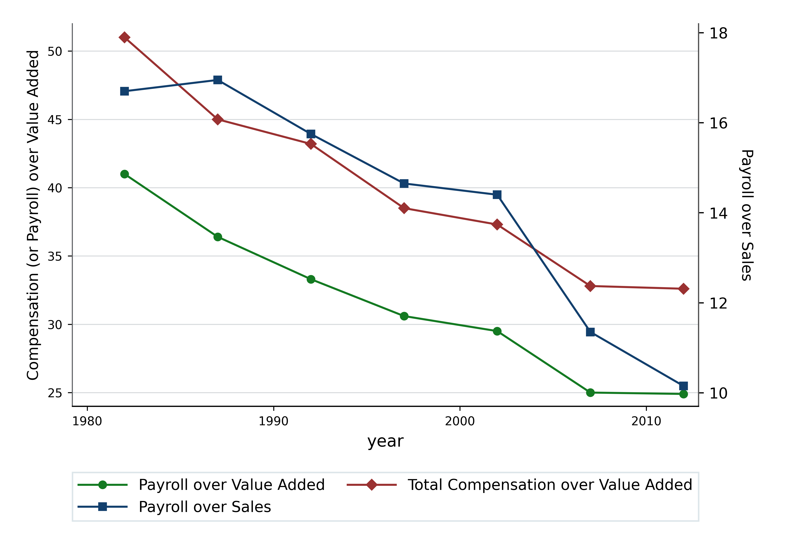

- **Subtype:** `sparse-three-series-dual-axis`
- **Use when:** Compare two related ratios with a third ratio on another scale; Show sparse long-run movements across benchmark years
- **Required fields:** `axis, series, series_order, value, year`
- **Data meaning:** position on the horizontal axis encodes order; line position encodes the supplied value
- **Tags:** `benchmark-year-x, dual-axis, external-legend, green-circle, horizontal-grid, independent-y-scales, line, navy-square, red-diamond, single-panel, sparse-time-points, two-row-legend-below, wide-landscape`
- **Code:** [`dual-axis-three-ratio-trends.py`](figures/line-trend/dual-axis-three-ratio-trends.py)

> Specialized constraint: Require explicit units and a written reason for using independent axes; never imply comparability from aligned slopes.

### dual-series-trend-prediction-2panel

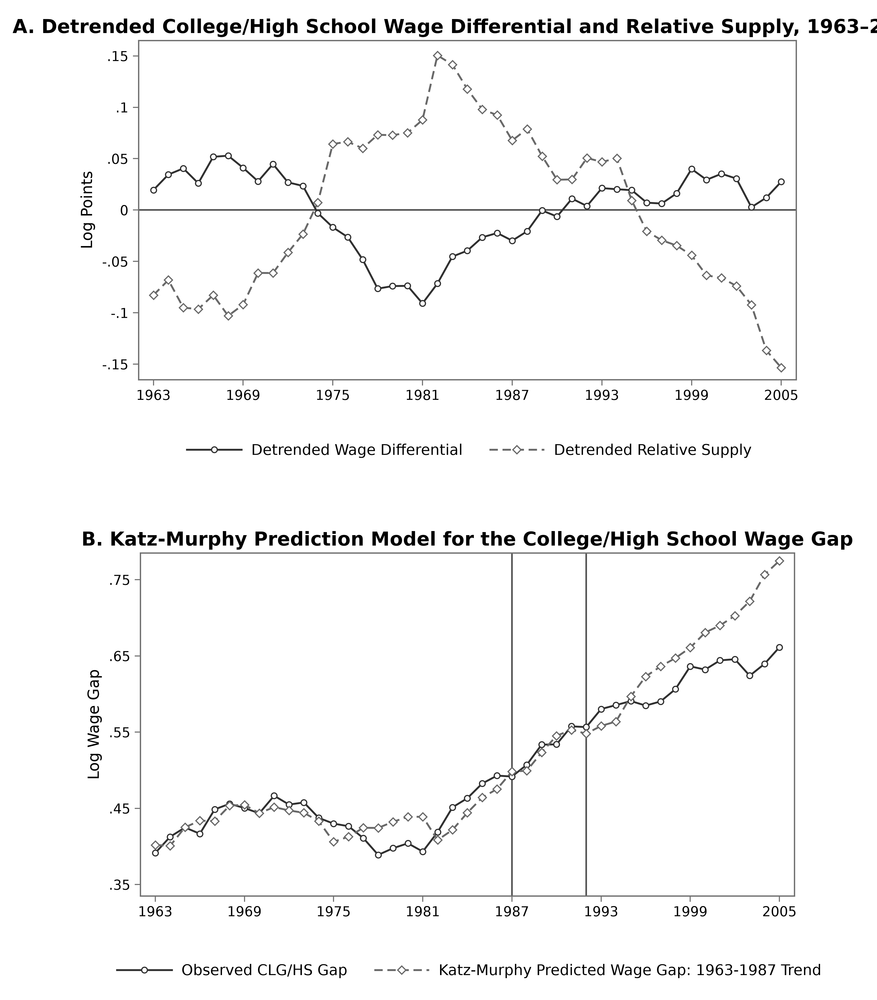

- **Subtype:** `vertically-stacked-observed-predicted-trends`
- **Use when:** Compare two related annual series after transformation or normalization; Compare an observed annual series with a supplied prediction over the same period; Mark externally supplied break years in one panel
- **Required fields:** `panel, panel_order, reference_x, reference_y, series, series_order, title, value, y_label, y_max, y_min, y_tick_end, y_tick_interval, y_tick_start, year`
- **Data meaning:** position on the horizontal axis encodes order; line position encodes the supplied value
- **Tags:** `aligned-panels, bold-panel-title, compact-publication-ratio, continuous-year-x, dashed-open-diamond, full-rectangular-spines, grayscale-safe, horizontal-zero-line, legends-below-panels, line, no-grid, panel-specific-y, separate-panel-legend, shared-year-range, solid-open-circle, two-panel, vertical-reference-line, vertical-stack`
- **Code:** [`dual-series-trend-prediction-2panel.py`](figures/line-trend/dual-series-trend-prediction-2panel.py)

### tariff-response-2x4-dashed-ci

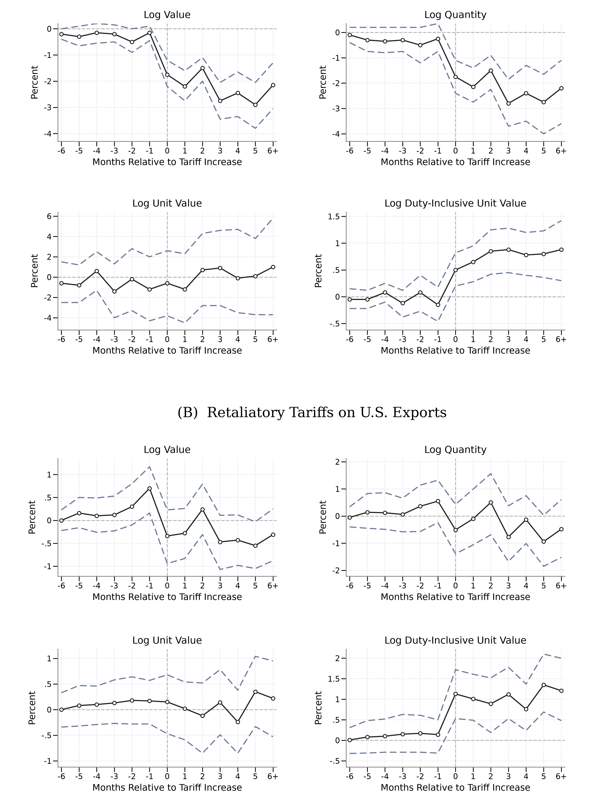

- **Subtype:** `two-block-four-panel-response-with-dashed-bounds`
- **Use when:** Compare dynamic responses across two tariff regimes; Inspect outcome-specific changes at an event date
- **Required fields:** `block, estimate, lower, month, panel_order, step, title, upper, ymax, ymin`
- **Data meaning:** position on the horizontal axis encodes order; line position encodes the supplied value
- **Tags:** `black-estimate, block-heading, dashed-bounds, eight-panels, event-month-x, event-reference, line, navy-interval, panel-title, percent-y, point-estimate, two-by-two-blocks`
- **Code:** [`tariff-response-2x4-dashed-ci.py`](figures/line-trend/tariff-response-2x4-dashed-ci.py)

## scatter-relationship

### automation-exposure-occupations-2panel

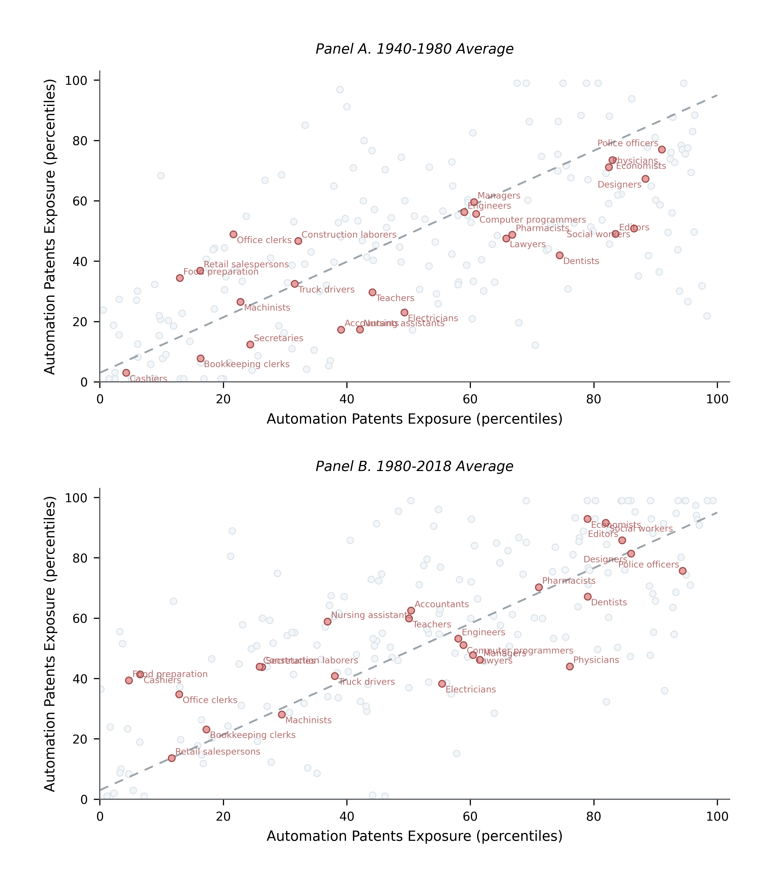

- **Subtype:** `occupation-exposure-two-period-panels`
- **Use when:** Compare occupation-level exposure relationships across periods; Identify named occupations with unusual exposure combinations
- **Required fields:** `automation_exposure, kind, label, panel, routine_exposure`
- **Data meaning:** horizontal and vertical position jointly encode a relationship; any fitted path must be explicitly authorized or supplied
- **Tags:** `direct-labels, faint-background-points, gray-dashed-fit, italic-panel-titles, muted-red-highlight-points, occupation-labels, percentile-x, percentile-y, portrait, scatter, shared-domain, supplied-linear-fit, two-panel, two-rows`
- **Code:** [`automation-exposure-occupations-2panel.py`](figures/scatter-relationship/automation-exposure-occupations-2panel.py)

> Specialized constraint: Do not fabricate observations or extend a fitted line beyond its supported domain.

### binscatter-diagnostic-2x2

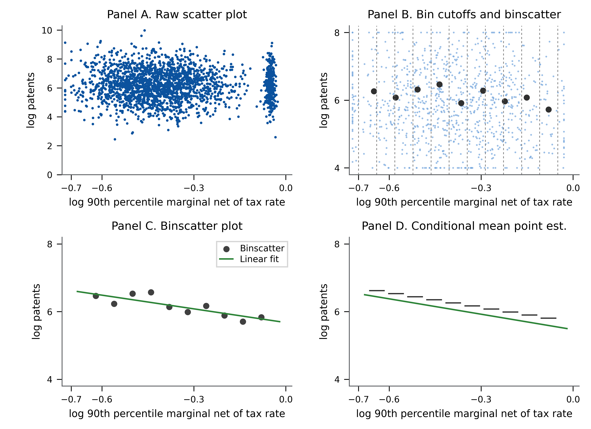

- **Subtype:** `raw-cutoff-binned-conditional-diagnostic`
- **Use when:** Explain how a dense raw relationship is reduced to binscatter means; Compare unconditional and conditional binned relationships
- **Required fields:** `kind, panel, x, y`
- **Data meaning:** horizontal and vertical position jointly encode a relationship; any fitted path must be explicitly authorized or supplied
- **Tags:** `binned-means, black-bin-means, blue-raw-points, compact-diagnostic-grid, dense-cloud, fitted-line, green-fit, horizontal-segments, panel-c-legend, panel-specific-titles, panel-specific-y-range, scatter, shared-x-domain, two-by-two, vertical-cutoffs`
- **Code:** [`binscatter-diagnostic-2x2.py`](figures/scatter-relationship/binscatter-diagnostic-2x2.py)

> Specialized constraint: Do not fabricate observations or extend a fitted line beyond its supported domain.

### cumulative-frequency-market-age

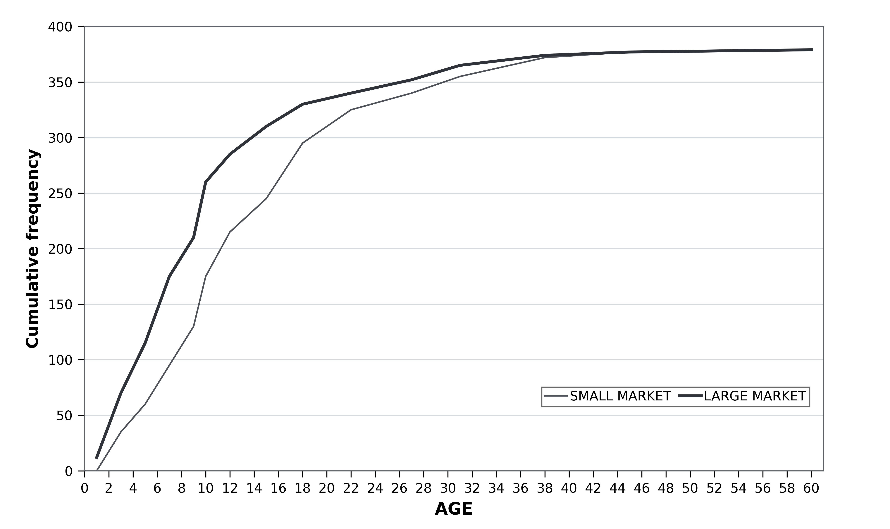

- **Subtype:** `two-market-cumulative-frequency-profile`
- **Use when:** Compare how quickly observations accumulate across age; Identify early distributional separation and later convergence
- **Required fields:** `age, cumulative_frequency, series`
- **Data meaning:** horizontal and vertical position jointly encode a relationship; any fitted path must be explicitly authorized or supplied
- **Tags:** `age-x, compact-inset-legend, cumulative-frequency-y, cumulative-line, full-frame, horizontal-grid, single-panel, sixty-ages, thick-black-line, thin-gray-line, two-series, wide-landscape`
- **Code:** [`cumulative-frequency-market-age.py`](figures/scatter-relationship/cumulative-frequency-market-age.py)

> Specialized constraint: Do not fabricate observations or extend a fitted line beyond its supported domain.

### employment-shock-binscatter

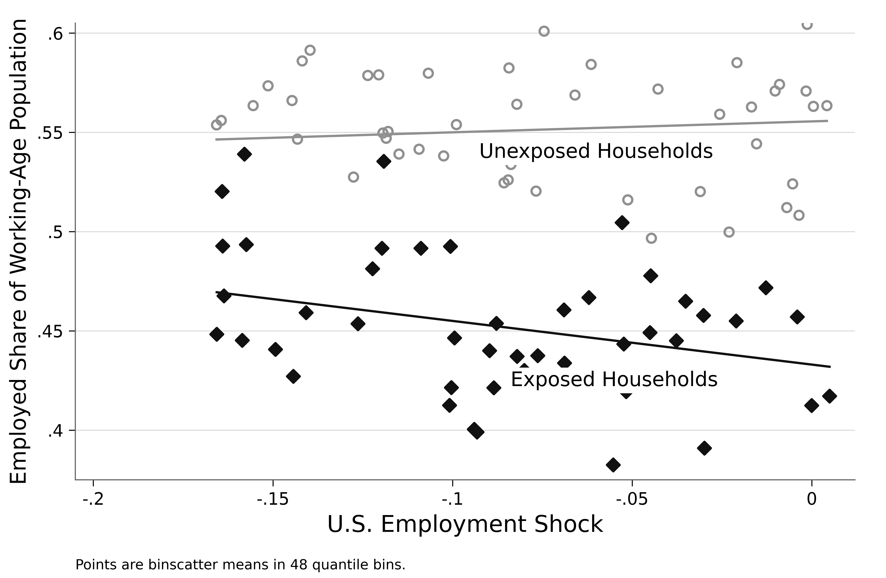

- **Subtype:** `two-group-binscatter-with-direct-labels`
- **Use when:** Compare heterogeneous relationships across exposed and unexposed groups; Show group-specific binned trends without a separate legend
- **Required fields:** `kind, series, x, y`
- **Data meaning:** horizontal and vertical position jointly encode a relationship; any fitted path must be explicitly authorized or supplied
- **Tags:** `binscatter, black-diamonds, bottom-method-note, direct-series-labels, dotted-grid, employed-share-y, hollow-gray-circles, linear-fit, matching-lines, negative-shock-x, single-panel, two-series, wide-landscape`
- **Code:** [`employment-shock-binscatter.py`](figures/scatter-relationship/employment-shock-binscatter.py)

> Specialized constraint: Do not fabricate observations or extend a fitted line beyond its supported domain.

### iv-diagnostic-2panel

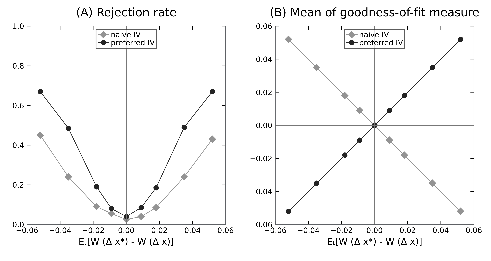

- **Subtype:** `paired-v-profile-and-crossing-profile`
- **Use when:** Compare rejection-rate behavior around a zero deviation; Show opposing goodness-of-fit profiles for two procedures
- **Required fields:** `panel, series, x, y`
- **Data meaning:** horizontal and vertical position jointly encode a relationship; any fitted path must be explicitly authorized or supplied
- **Tags:** `black-circles, connected-points, crossing-lines, full-frame, gray-diamonds, horizontal-zero-line, inset-top-legends, inward-ticks, one-by-two, panel-titles, shared-width, two-panels, v-profile, vertical-zero-line`
- **Code:** [`iv-diagnostic-2panel.py`](figures/scatter-relationship/iv-diagnostic-2panel.py)

> Specialized constraint: Do not fabricate observations or extend a fitted line beyond its supported domain.

### peer-input-distributions-2x2

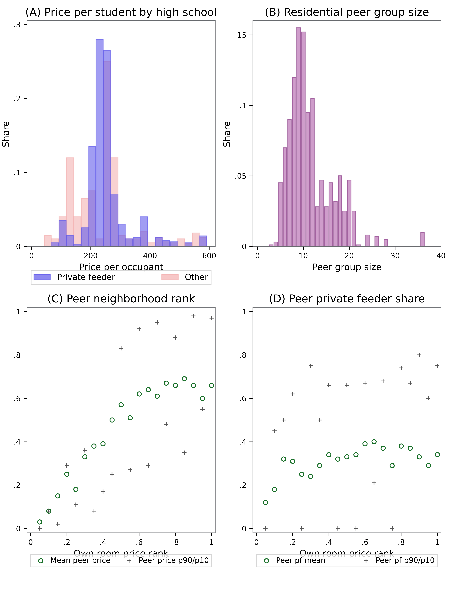

- **Subtype:** `two-histograms-and-two-peer-comparison-panels`
- **Use when:** Audit peer-variable input distributions; Compare peer means with peer-range summaries across own-rank positions
- **Required fields:** `kind, panel, series, width, x, y`
- **Data meaning:** horizontal and vertical position jointly encode a relationship; any fitted path must be explicitly authorized or supplied
- **Tags:** `bounded-zero-to-one-scales, four-panels, hollow-circle, legends-below-selected-panels, overlaid-histogram, paired-scatter, panel-local-legends, panel-titles, plus-marker, share-y, single-histogram, transparent-overlap, two-by-two`
- **Code:** [`peer-input-distributions-2x2.py`](figures/scatter-relationship/peer-input-distributions-2x2.py)

> Specialized constraint: Do not fabricate observations or extend a fitted line beyond its supported domain.

### placement-rate-maltreatment-fits-2panel

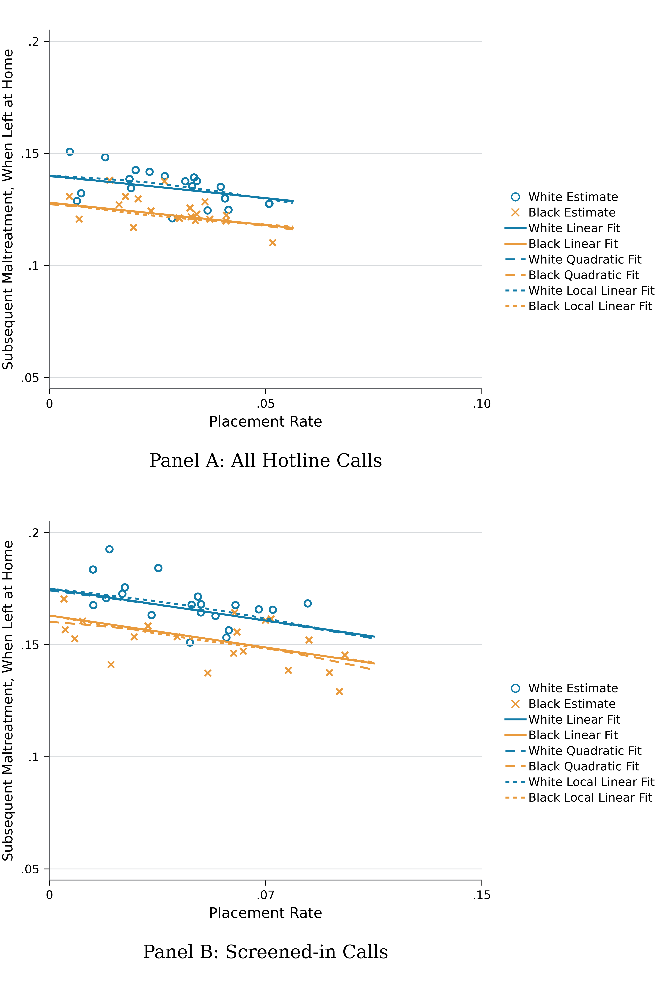

- **Subtype:** `two-group-three-fit-comparison-2panel`
- **Use when:** Compare functional-form sensitivity for two groups; Contrast results across all calls and screened-in calls
- **Required fields:** `group, kind, panel, x, y`
- **Data meaning:** horizontal and vertical position jointly encode a relationship; any fitted path must be explicitly authorized or supplied
- **Tags:** `blue-circle, captions-below-panels, dashed-line, dotted-grid, dotted-line, large-external-legends, linear-fit, local-linear-fit, orange-cross, panel-specific-x-range, quadratic-fit, reserved-right-legend-column, scatter, shared-y-range, solid-line, two-panels, vertical-two-panel`
- **Code:** [`placement-rate-maltreatment-fits-2panel.py`](figures/scatter-relationship/placement-rate-maltreatment-fits-2panel.py)

> Specialized constraint: Do not fabricate observations or extend a fitted line beyond its supported domain.

### transaction-price-value-2x2

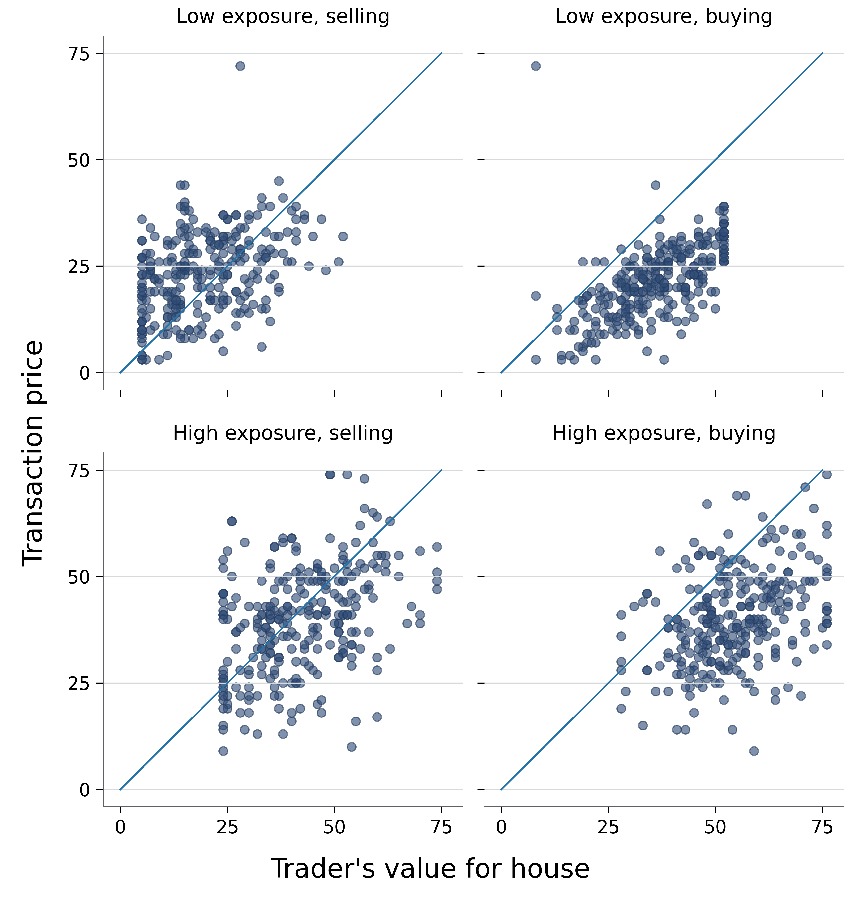

- **Subtype:** `four-regime-scatter-against-identity`
- **Use when:** Compare price-value alignment across four market regimes; Diagnose dispersion and censoring relative to an identity benchmark
- **Required fields:** `kind, panel, x, y`
- **Data meaning:** horizontal and vertical position jointly encode a relationship; any fitted path must be explicitly authorized or supplied
- **Tags:** `aligned-grid, dense-cloud, diagonal-reference, four-panels, narrow-panel-gutters, panel-titles, scatter, semi-transparent-blue-circles, shared-axis-labels, shared-zero-to-75-domain, thin-blue-identity-line, two-by-two`
- **Code:** [`transaction-price-value-2x2.py`](figures/scatter-relationship/transaction-price-value-2x2.py)

> Specialized constraint: Do not fabricate observations or extend a fitted line beyond its supported domain.

## stacked-bar

### decomposition-100pct-hbar-2x2

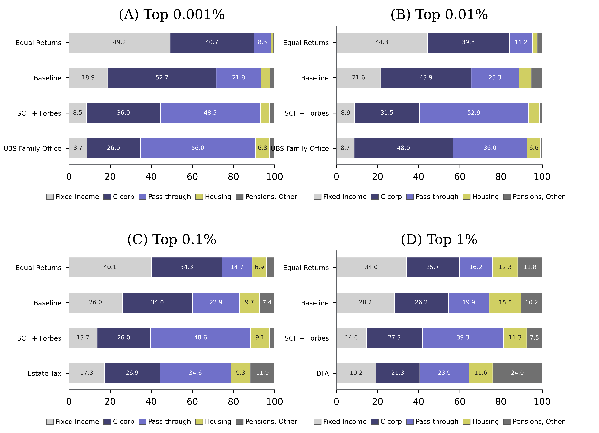

- **Subtype:** `four-panel-labeled-horizontal-decomposition`
- **Use when:** Compare component decompositions across top-share thresholds; Show how portfolio composition changes across assumptions
- **Required fields:** `category, category_order, component, component_order, panel, panel_order, share`
- **Data meaning:** segment size encodes a component; normalized assets require components to sum to the declared whole
- **Tags:** `dark-gray, five-components, four-panel, gray, horizontal-bar, in-segment-values, lettered-panel-titles, navy, normalized-stack, ordered-category-y, panel-specific-bottom-legends, percent-x, repeated-panel-legends, two-by-two, violet, yellow`
- **Code:** [`decomposition-100pct-hbar-2x2.py`](figures/stacked-bar/decomposition-100pct-hbar-2x2.py)

> Specialized constraint: Validate the declared denominator and require each displayed whole to sum to 100% within tolerance.

### decomposition-100pct-hbar-outcomes

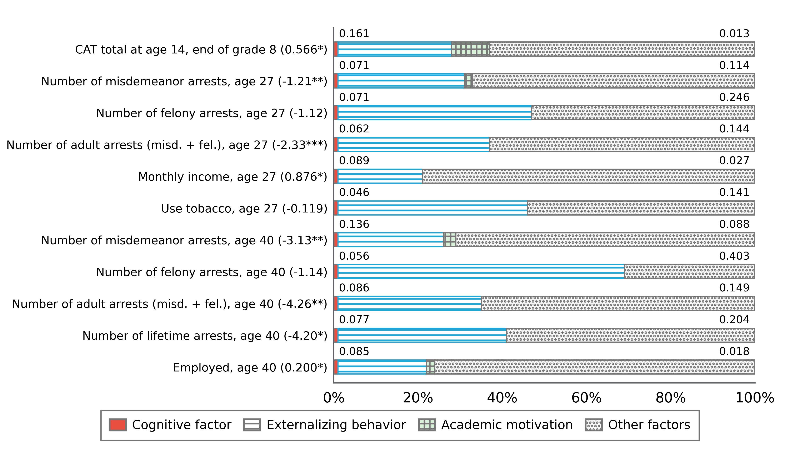

- **Subtype:** `outcome-factor-horizontal-decomposition`
- **Use when:** Compare factor contributions across many outcomes; Show dominant and residual components with supplied edge statistics
- **Required fields:** `component, component_order, left_label, outcome, outcome_order, right_label, share`
- **Data meaning:** segment size encodes a component; normalized assets require components to sum to the declared whole
- **Tags:** `bar-edge-labels, blue-lines, bottom-boxed-legend, compact-landscape, eleven-outcomes, gray-dot-hatch, green-crosshatch, horizontal-bar, long-outcome-y, normalized-stack, outcome-statistics, percent-x, red-marker-fill, redundant-pattern, wide-left-label-margin`
- **Code:** [`decomposition-100pct-hbar-outcomes.py`](figures/stacked-bar/decomposition-100pct-hbar-outcomes.py)

> Specialized constraint: Validate the declared denominator and require each displayed whole to sum to 100% within tolerance.

### normalized-stacked-vbar-2x4

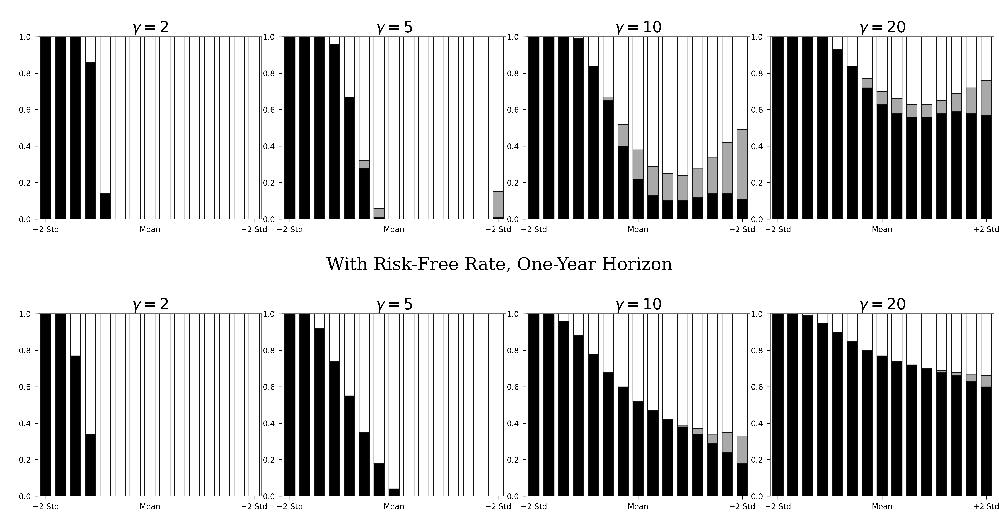

- **Subtype:** `eight-panel-normalized-allocation-bars`
- **Use when:** Compare allocation regimes across standardized states; Show how normalized compositions change under four parameter settings and two model variants
- **Required fields:** `component, component_order, gamma, panel_order, position, row_group, share`
- **Data meaning:** segment size encodes a component; normalized assets require components to sum to the declared whole
- **Tags:** `black, dense-small-multiples, eight-panel, full-spines, gamma-panel-titles, gray, grayscale-safe, middle-row-descriptor, normalized-stack, proportion-y, shared-scale, standardized-position-x, two-by-four, two-row-grid, vertical-bar, white-outline`
- **Code:** [`normalized-stacked-vbar-2x4.py`](figures/stacked-bar/normalized-stacked-vbar-2x4.py)

> Specialized constraint: Validate the declared denominator and require each displayed whole to sum to 100% within tolerance.

### paired-stacked-vbar-sector

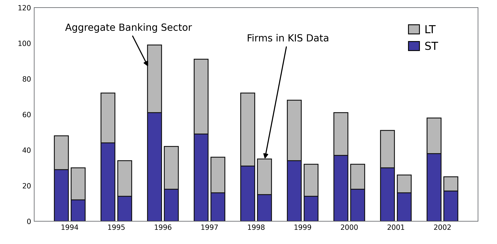

- **Subtype:** `paired-sample-stacked-annual-bars`
- **Use when:** Compare two samples across years while retaining component composition; Show annual totals split into short-term and long-term portions
- **Required fields:** `component, component_order, sample, sample_order, value, year`
- **Data meaning:** segment size encodes a component; normalized assets require components to sum to the declared whole
- **Tags:** `annual, arrow-direct-labels, compact-top-right-legend, continuous-year-x, gray-long-term, paired-within-year, single-panel, stacked, total-y, vertical-bar, violet-short-term, wide-landscape, zero-baseline`
- **Code:** [`paired-stacked-vbar-sector.py`](figures/stacked-bar/paired-stacked-vbar-sector.py)

## waterfall

### export-value-added-waterfall-2panel

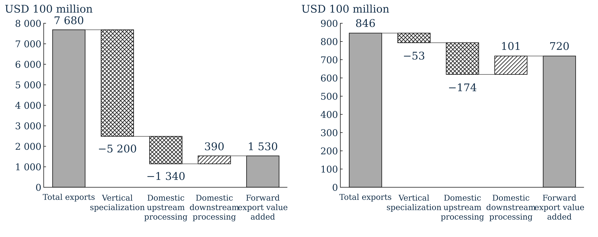

- **Subtype:** `export-value-added-waterfall-2panel`
- **Use when:** Show two export-value-added decompositions using supplied step endpoints.
- **Required fields:** `display, end, kind, label, order, panel, start`
- **Data meaning:** bar direction encodes sign and cumulative position encodes contribution to the running total
- **Tags:** `connectors, crosshatched-reductions, diagonal-hatched-increases, total-bars, two-panel-waterfall`
- **Code:** [`export-value-added-waterfall-2panel.py`](figures/waterfall/export-value-added-waterfall-2panel.py)

> Specialized constraint: Preserve component order, sign, and supplied totals; disclose any discontinuous scale.

### index-change-component-dashboard

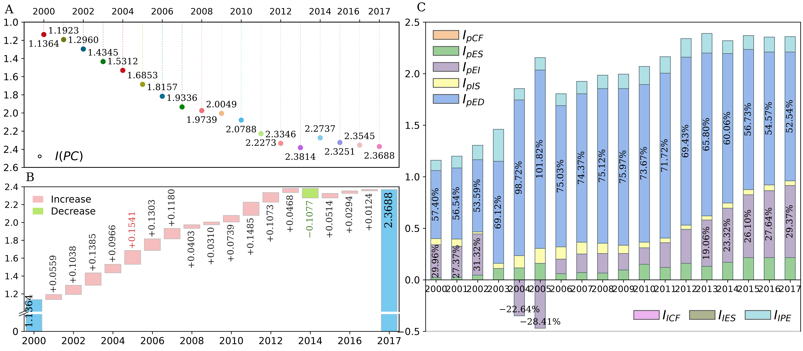

- **Subtype:** `index-change-component-dashboard`
- **Use when:** Show supplied index levels, changes and component contributions in one coordinated display.
- **Required fields:** `bottom, color, display, end, level, order, series, start, top, year`
- **Data meaning:** bar direction encodes sign and cumulative position encodes contribution to the running total
- **Tags:** `broken-axis-waterfall, inside-bar-percentages, inverted-level-axis, positive-negative-stacks, split-component-legends`
- **Code:** [`index-change-component-dashboard.py`](figures/waterfall/index-change-component-dashboard.py)

> Specialized constraint: Preserve component order, sign, and supplied totals; disclose any discontinuous scale.
